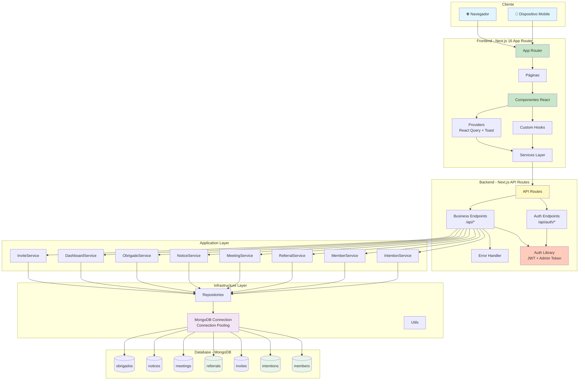
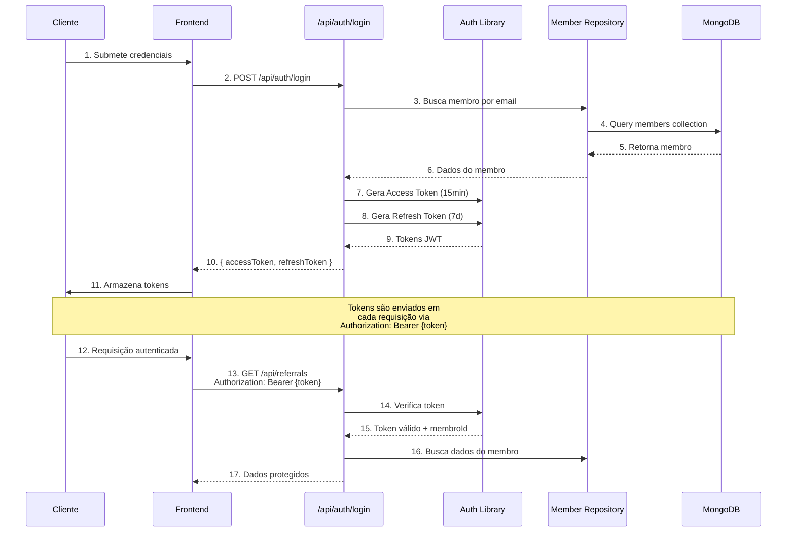
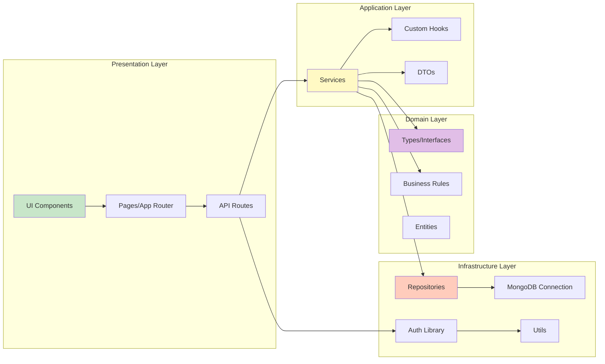
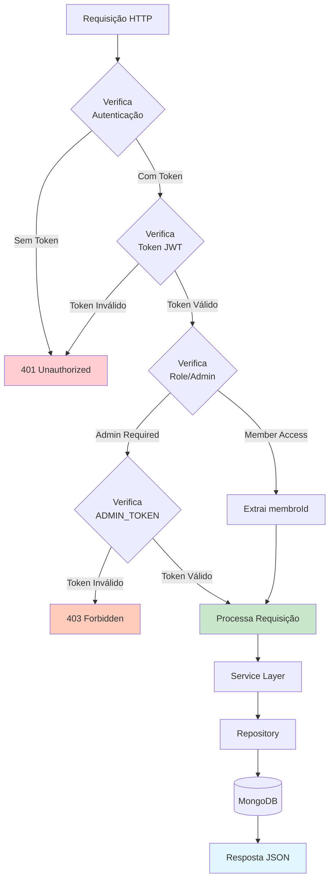
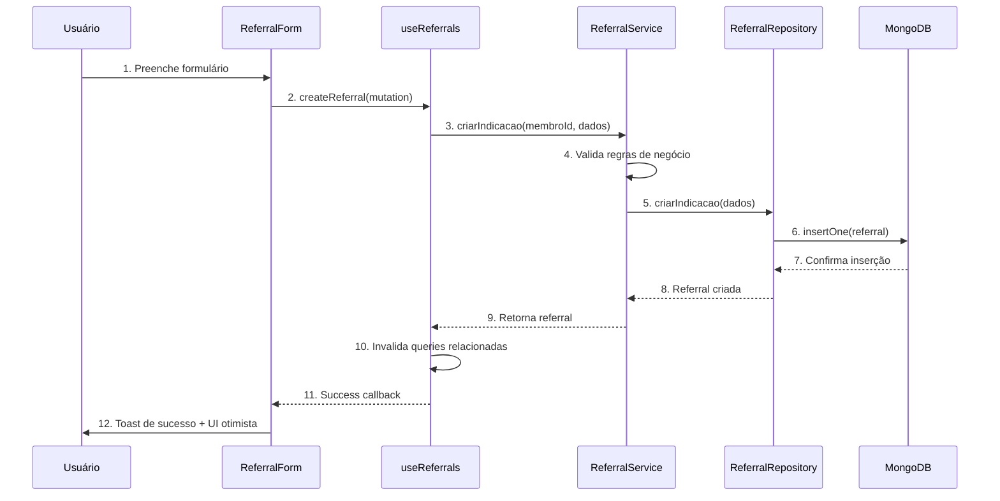
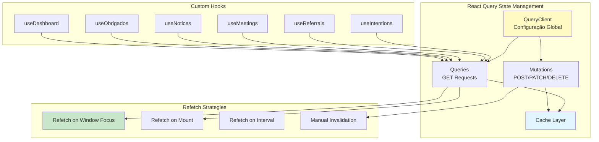
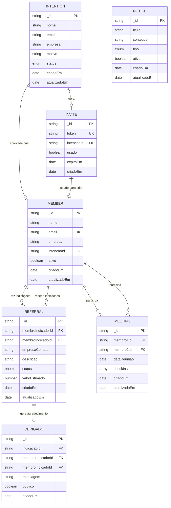
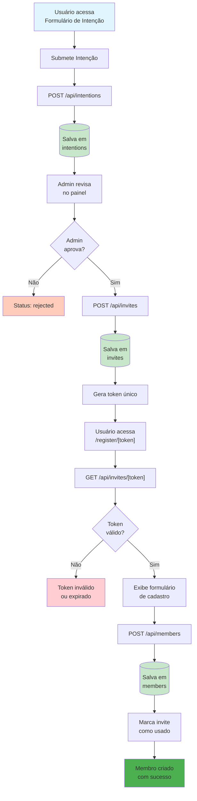
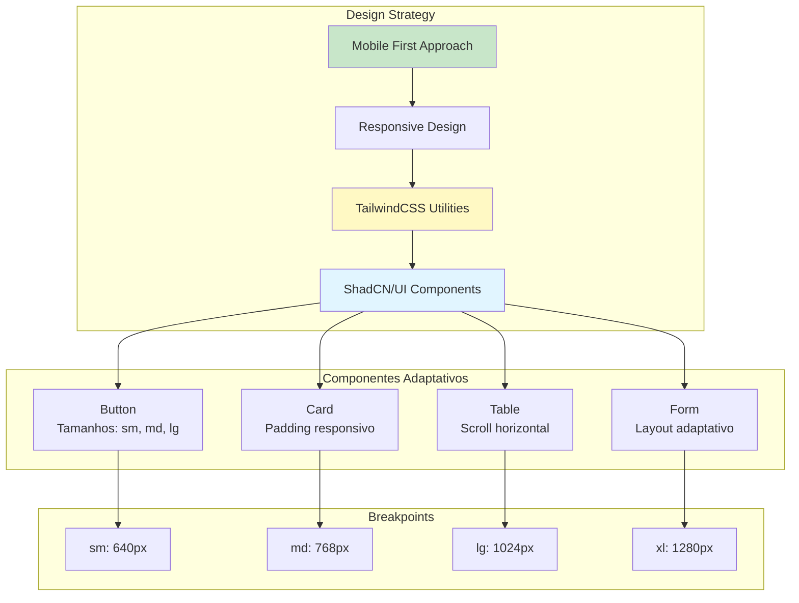

# 🏗 Arquitetura do Sistema

Este documento descreve a arquitetura completa da Plataforma de Gestão para Grupos de Networking, incluindo os principais componentes, fluxos de comunicação e decisões arquiteturais.

## 📊 Diagrama de Arquitetura Geral



## 🔄 Fluxo de Autenticação JWT



## 🏛 Camadas da Aplicação (Clean Architecture)



## 🔐 Fluxo de Autorização



## 📦 Fluxo de Dados - Criação de Indicação



## 🔄 Fluxo de Estado Global (React Query)



## 🗄 Estrutura de Dados e Relacionamentos



## 🚀 Fluxo Completo: Intenção → Membro



## 📱 Responsividade e Mobile First



## 📡 Definição da API

A API REST foi projetada seguindo os princípios RESTful, com endpoints claros, métodos HTTP apropriados e respostas padronizadas. Abaixo estão os principais endpoints implementados:

### Autenticação

A API utiliza dois tipos de autenticação:
- **JWT (JSON Web Token)**: Para membros autenticados (access token válido por 15 minutos, refresh token por 7 dias)
- **Admin Token**: Para operações administrativas (token configurado via variável de ambiente `ADMIN_TOKEN`)

### Formato de Resposta Padrão

Todas as respostas seguem o formato:

```typescript
{
  success: boolean;
  data?: any;
  message?: string;
  error?: string;
  details?: Array<{
    path: string;
    message: string;
  }>;
}
```

### Principais Endpoints

#### 1. POST /api/intentions

Cria uma nova intenção de participação no grupo (endpoint público).

**Autenticação**: Não requerida (público)

**Request Body**:
```json
{
  "nome": "João Silva",
  "email": "joao@empresa.com",
  "empresa": "Empresa XYZ",
  "cargo": "Diretor Comercial",
  "motivo": "Desejo participar do grupo para expandir minha rede de contatos..."
}
```

**Response 201**:
```json
{
  "success": true,
  "data": {
    "_id": "507f1f77bcf86cd799439011",
    "nome": "João Silva",
    "email": "joao@empresa.com",
    "empresa": "Empresa XYZ",
    "cargo": "Diretor Comercial",
    "motivo": "Desejo participar do grupo...",
    "status": "pending",
    "criadoEm": "2025-01-27T10:00:00.000Z"
  },
  "message": "Intenção criada com sucesso! Aguarde a análise do administrador."
}
```

**Validações**:
- `nome`: 2-100 caracteres
- `email`: Email válido e único
- `empresa`: 2-100 caracteres
- `motivo`: 10-500 caracteres

**Erros**:
- `400`: Dados inválidos (validação Zod)
- `409`: Email já cadastrado
- `500`: Erro interno do servidor

---

#### 2. GET /api/intentions

Lista todas as intenções submetidas (apenas para administradores).

**Autenticação**: Admin Token (requer `ADMIN_TOKEN` no header)

**Query Parameters**:
- `status` (opcional): Filtro por status (`pending` | `approved` | `rejected`)
- `page` (opcional): Número da página (default: 1)
- `limit` (opcional): Itens por página (default: 20)

**Headers**:
```
Authorization: Bearer {ADMIN_TOKEN}
```

**Request Example**:
```
GET /api/intentions?status=pending&page=1&limit=20
Authorization: Bearer {ADMIN_TOKEN}
```

**Response 200**:
```json
{
  "success": true,
  "data": [
    {
      "_id": "507f1f77bcf86cd799439011",
      "nome": "João Silva",
      "email": "joao@empresa.com",
      "empresa": "Empresa XYZ",
      "status": "pending",
      "criadoEm": "2025-01-27T10:00:00.000Z"
    }
  ],
  "pagination": {
    "page": 1,
    "limit": 20,
    "total": 45,
    "totalPages": 3
  }
}
```

**Erros**:
- `401`: Token de autenticação ausente ou inválido
- `500`: Erro interno do servidor

---

#### 3. POST /api/referrals

Cria uma nova indicação de negócio entre membros (requer autenticação JWT).

**Autenticação**: JWT (requer access token no header)

**Request Body**:
```json
{
  "membroIndicadoId": "507f1f77bcf86cd799439013",
  "empresaContato": "Empresa ABC",
  "descricao": "Indicação de cliente potencial interessado em serviços de consultoria...",
  "valorEstimado": 50000,
  "observacoes": "Cliente está em fase de decisão, contato preferencial via email"
}
```

**Headers**:
```
Authorization: Bearer {accessToken}
```

**Response 201**:
```json
{
  "success": true,
  "data": {
    "_id": "507f1f77bcf86cd799439020",
    "membroIndicadorId": "507f1f77bcf86cd799439012",
    "membroIndicadoId": "507f1f77bcf86cd799439013",
    "empresaContato": "Empresa ABC",
    "descricao": "Indicação de cliente potencial...",
    "valorEstimado": 50000,
    "status": "nova",
    "criadoEm": "2025-01-27T10:00:00.000Z"
  },
  "message": "Indicação criada com sucesso"
}
```

**Validações**:
- `membroIndicadoId`: ID válido de membro ativo
- `empresaContato`: 2-100 caracteres
- `descricao`: 10-1000 caracteres
- `valorEstimado`: Opcional, entre 1000 e 10000000

**Regras de Negócio**:
- Não permite auto-indicação (membro não pode indicar a si mesmo)
- Membro indicador e indicado devem estar ativos
- Membro indicado deve existir no sistema

**Erros**:
- `401`: Token de autenticação ausente ou inválido
- `400`: Dados inválidos (validação Zod)
- `403`: Membro inativo
- `404`: Membro indicado não encontrado
- `409`: Tentativa de auto-indicação
- `500`: Erro interno do servidor

---

#### 4. GET /api/referrals

Lista indicações do membro autenticado (feitas e recebidas).

**Autenticação**: JWT (requer access token no header)

**Query Parameters**:
- `tipo` (opcional): Tipo de indicações (`feitas` | `recebidas` | `ambas`, default: `ambas`)
- `status` (opcional): Filtro por status (`nova` | `em-contato` | `fechada` | `recusada`)
- `page` (opcional): Número da página (default: 1)
- `limit` (opcional): Itens por página (default: 20, max: 100)

**Response 200**: Lista paginada de indicações (feitas e recebidas)

---

#### 5. PATCH /api/referrals/[id]/status

Atualiza o status de uma indicação (apenas o membro indicado pode atualizar).

**Autenticação**: JWT (requer access token no header)

**Request Body**:
```json
{
  "status": "em-contato"
}
```

**Transições Válidas**:
- `nova` → `em-contato` ou `recusada`
- `em-contato` → `fechada` ou `recusada`
- `fechada` → (status final, não pode ser alterado)
- `recusada` → (status final, não pode ser alterado)

**Response 200**: Indicação atualizada

---

#### 6. POST /api/members

Cria um novo membro usando token de convite válido.

**Autenticação**: Não requerida (mas requer token de convite válido no body)

**Request Body**:
```json
{
  "nome": "João Silva",
  "email": "joao@empresa.com",
  "empresa": "Empresa XYZ",
  "token": "uuid-do-convite"
}
```

**Response 201**: Membro criado

---

#### 7. GET /api/members

Lista todos os membros (apenas para administradores).

**Autenticação**: Admin Token (requer `ADMIN_TOKEN` no header)

**Query Parameters**:
- `ativos` (opcional, boolean): Se `true`, retorna apenas membros ativos

**Response 200**: Lista de membros

---

### Outros Endpoints

- **POST /api/invites**: Cria convite para cadastro (apenas admin)
- **GET /api/invites/[token]**: Valida token de convite
- **POST /api/auth/login**: Autentica membro e retorna tokens JWT
- **POST /api/auth/refresh**: Renova access token usando refresh token
- **POST /api/auth/logout**: Invalida access token (logout seguro)

Para documentação completa de todos os endpoints, consulte [API_REFERENCE.md](./Docs/Documentation/API_REFERENCE.md).

## 🔧 Tecnologias e Ferramentas

### Frontend
- **Next.js 16.0.1** - Framework React com App Router
- **React 19.2.0** - Biblioteca UI
- **TypeScript 5** - Tipagem estática
- **TailwindCSS 4** - Estilização utilitária
- **ShadCN/UI** - Componentes UI reutilizáveis
- **Framer Motion 12.23.24** - Animações
- **TanStack Query 5.90.7** - Gerenciamento de estado assíncrono
- **React Hook Form 7.66.0** - Gerenciamento de formulários
- **Zod 4.1.12** - Validação de schemas

### Backend
- **Next.js API Routes** - API REST integrada
- **MongoDB 7.0.0** - Banco de dados NoSQL
- **Mongoose** - ODM para MongoDB (não utilizado diretamente, apenas MongoDB driver nativo)

### Autenticação
- **JWT (jsonwebtoken)** - Tokens de acesso e refresh
- **Admin Token** - Autenticação administrativa simples

### Testes
- **Jest 30.2.0** - Framework de testes
- **React Testing Library 16.3.0** - Testes de componentes
- **@faker-js/faker 10.1.0** - Geração de dados fake

## 🎯 Decisões Arquiteturais

### 1. Next.js App Router
- **Justificativa**: App Router do Next.js 16 oferece Server Components, melhor performance e SEO
- **Benefícios**: Renderização no servidor, code splitting automático, rotas aninhadas

### 2. MongoDB (NoSQL)
- **Justificativa**: Flexibilidade para evoluir o schema, escalabilidade horizontal, suporte a documentos aninhados
- **Benefícios**: Schema flexível, queries eficientes com agregações, suporte nativo a arrays e objetos

### 3. Clean Architecture
- **Justificativa**: Separação de responsabilidades, testabilidade, manutenibilidade
- **Camadas**: Presentation → Application → Domain → Infrastructure

### 4. React Query (TanStack Query)
- **Justificativa**: Gerenciamento eficiente de estado assíncrono, cache inteligente, refetch automático
- **Benefícios**: Menos código boilerplate, sincronização automática, UI otimista

### 5. TypeScript Strict
- **Justificativa**: Segurança de tipos, melhor DX, menos bugs em produção
- **Benefícios**: Autocomplete, refatoração segura, documentação implícita

## 📈 Escalabilidade

O sistema foi projetado para escalar horizontalmente:

1. **Connection Pooling**: MongoDB connection pool configurado (min: 2, max: 10)
2. **Stateless API**: API Routes são stateless, permitindo múltiplas instâncias
3. **Cache Strategy**: React Query gerencia cache no cliente, reduzindo carga no servidor
4. **Database Indexes**: Índices criados em campos frequentemente consultados

## 🔒 Segurança

1. **JWT Tokens**: Access tokens (15min) e refresh tokens (7d)
2. **Admin Token**: Autenticação separada para operações administrativas
3. **Validação de Input**: Zod schemas em todos os endpoints
4. **Error Handling**: Erros não expõem informações sensíveis
5. **HTTPS**: Obrigatório em produção

---

**Última atualização**: 2025-01-27  
**Versão da Arquitetura**: 1.0.0

**Desenvolvido com ❤️ pela equipe Durch Soluções**

