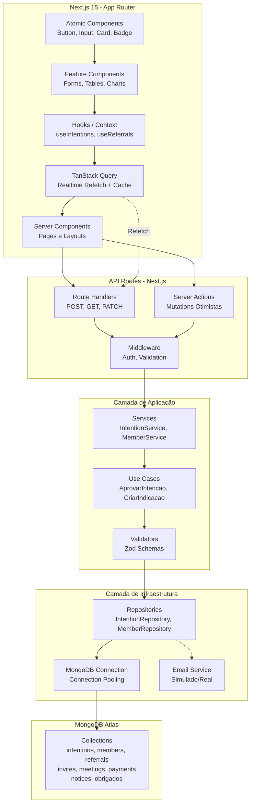
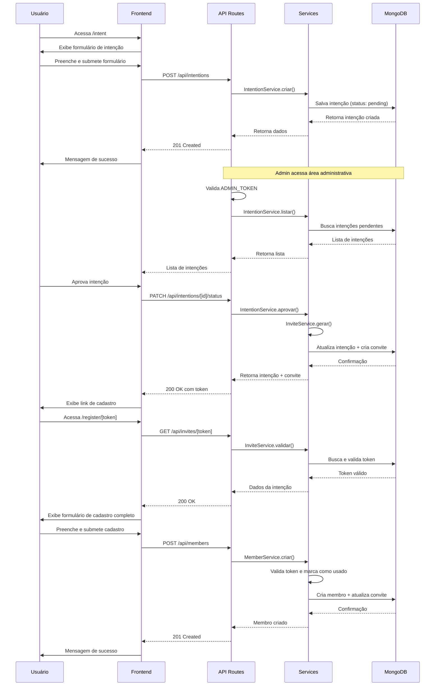
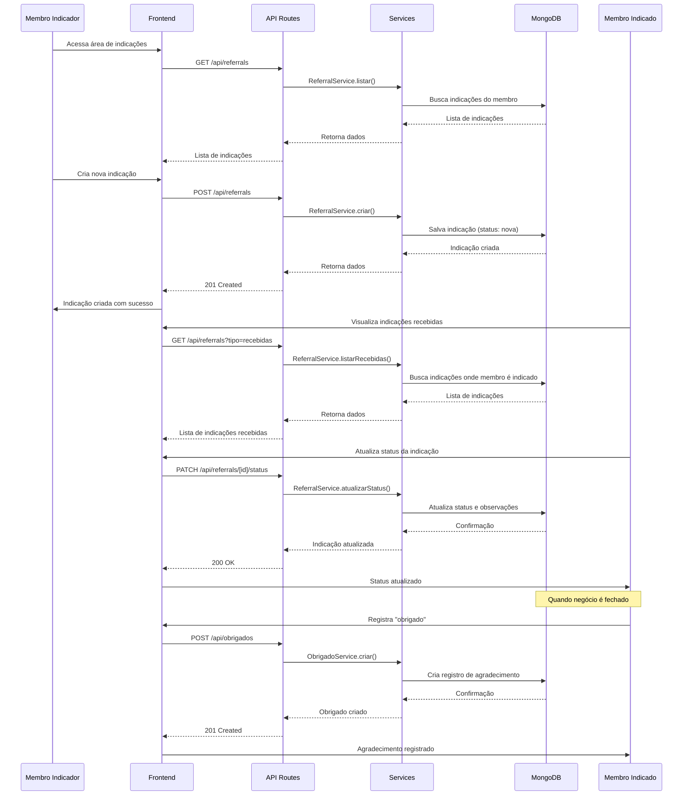
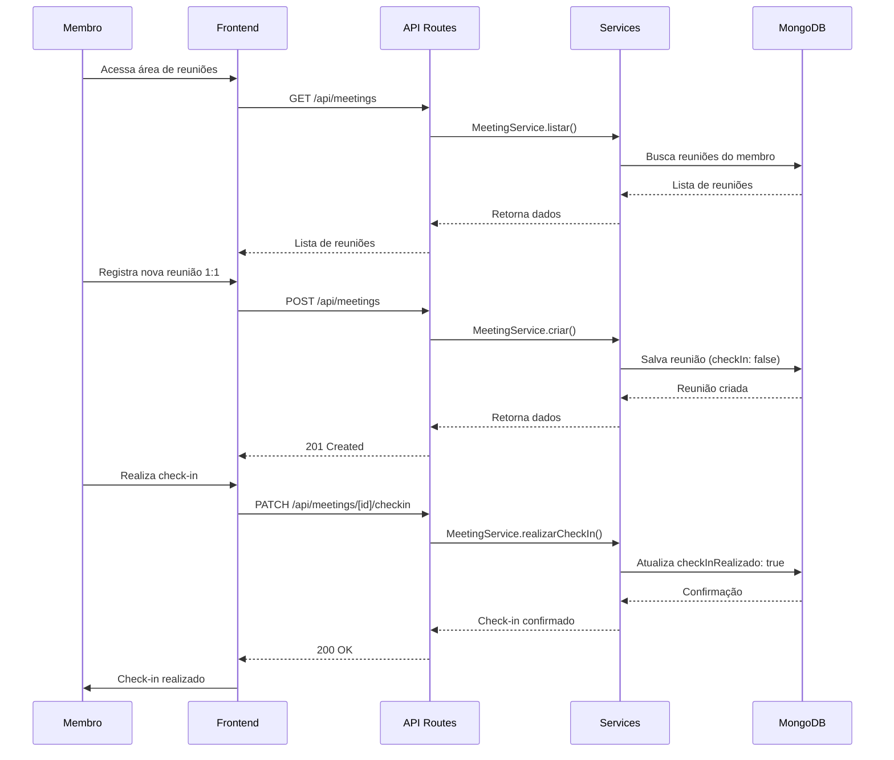
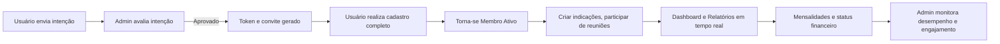

# 📘 Organização Inicial do Projeto
**Projeto:** Plataforma de Gestão para Grupos de Networking  
**Stack:** Next.js 15 (App Router) + Node.js + MongoDB + TailwindCSS + ShadCN/UI + Jest + React Testing Library + Cypress  
**Arquitetura:** Clean Architecture + Clean Code + UI Otimista + ATOMIC Design + Mobile First  

---

## 🎯 1. Objetivo do Sistema
O objetivo é digitalizar e otimizar a gestão de grupos de networking, eliminando planilhas e controles manuais, através de uma solução integrada, responsiva, em tempo real e altamente performática.

---

## 📊 1.1 Status de Implementação

### ✅ Concluído
- [x] **Feature 1: Setup e Infraestrutura Base**
  - Configuração do Next.js 15 com App Router
  - Conexão MongoDB com connection pooling e transactions
  - TanStack Query configurado com refetch inteligente
  - Jest e React Testing Library configurados
  - Estrutura de pastas organizada (Clean Architecture)
  - Variáveis de ambiente configuradas

- [x] **Feature 2: Componentes UI Base (Parcial)**
  - Button (variantes, tamanhos, loading, animações)
  - Input (label, error, helperText)
  - Textarea
  - Card (variantes, subcomponentes)
  - Badge (variantes de status)
  - Skeleton (loading states)

- [x] **Feature 3: Fluxo de Admissão - Intenções Públicas**
  - API Route: `POST /api/intentions`
  - Página pública: `app/intention/page.tsx`
  - Formulário: `IntentionForm.tsx` com validação React Hook Form + Zod
  - Hook: `useIntentions.ts` com React Query
  - Testes unitários e de integração

- [x] **Estrutura de Dados**
  - Tipos TypeScript: Intention, Member, Invite, Referral
  - DTOs para todas as entidades
  - Validações Zod implementadas

- [x] **Repositórios MongoDB**
  - IntentionRepository
  - MemberRepository
  - InviteRepository
  - ReferralRepository

- [x] **Serviços de Aplicação**
  - IntentionService (validação, criação, busca, atualização)
  - InviteService (geração de token, validação, marcação de uso)
  - MemberService (criação com validação de token)
  - ReferralService (criação, busca, atualização de status)

- [x] **Helpers de Teste**
  - Faker.js configurado (pt_BR)
  - Funções para gerar dados fake
  - Seeders para popular banco de dados

### ✅ Concluído (Atualizado)
- [x] **Feature 4: Fluxo de Admissão - Área Administrativa**
  - Listagem de intenções com paginação e filtros
  - Aprovação/recusa de intenções
  - Geração automática de convite ao aprovar
  - Proteção com ADMIN_TOKEN
  - Página admin `/admin/intents`
  - Componentes: IntentionList, IntentionCard

- [x] **Feature 5: Sistema de Convites (APIs)**
  - API POST /api/invites (gerar convite manualmente)
  - API GET /api/invites/[token] (validar token)
  - Geração automática ao aprovar intenção
  - Validação de token (expirado, usado)

- [x] **Feature 6: Cadastro Completo de Membros**
  - Página pública `/register/[token]`
  - Validação de token antes de exibir formulário
  - Formulário completo (telefone, linkedin, área de atuação)
  - API POST /api/members
  - Marca token como usado após cadastro
  - Componente: MemberForm

### ✅ Concluído (Atualizado - Dez 2024)
- [x] **Feature 7: Sistema de Indicações**
  - API POST /api/referrals (criar indicação)
  - API GET /api/referrals (listar indicações feitas/recebidas com filtros)
  - API PATCH /api/referrals/[id]/status (atualizar status - apenas destinatário)
  - API GET /api/members (listar membros ativos - admin)
  - Hook useReferrals com React Query
  - Componentes: ReferralForm, ReferralList, ReferralCard, ReferralStatusBadge, ReferralStatusUpdate
  - Página /referrals para gestão completa
  - Validações de negócio (auto-indicação, membros ativos, transições de status)
  - Correções de tipos TypeScript (ZodError.issues, ObjectId conversions)

### 📋 Pendente
- [ ] Feature 8: Testes e Qualidade (cobertura ≥ 95%)
- [ ] Feature 9: Documentação adicional
- [ ] Feature 10: Refinamentos e Otimizações

---

## 🧩 2. Funcionalidades Principais

### **2.1 Gestão de Membros**
- Formulário público de **intenção de participação** (nome, e-mail, empresa, cargo, motivo).  
- Painel administrativo com **aprovação/recusa** de intenções.  
- Geração de **token único** de convite para cadastro completo.  
- Formulário de **cadastro completo** com dados adicionais (telefone, rede social, empresa).  

### **2.2 Comunicação e Engajamento**
- Área de **avisos e comunicados internos**.  
- Controle de **presença (check-in)** em reuniões.  

### **2.3 Geração de Negócios**
- ✅ Criação e acompanhamento de **indicações de negócios** entre membros.  
- ✅ Status: *nova*, *em-contato*, *fechada*, *recusada*.  
- ⏳ Registro de **"obrigados"**, agradecimentos públicos por negócios concluídos (pendente).  

### **2.4 Acompanhamento e Performance**
- Registro de **reuniões 1:1** entre membros.  
- **Dashboard de performance** individual e coletivo.  
- Relatórios (semanal, mensal e acumulado).  

### **2.5 Financeiro**
- **Módulo de mensalidades** com geração e controle de status de pagamento.  

---

## 🧩 Módulo Opcional escolhido: Opção A - Sistema de Indicações

### 🎯 Objetivo

Implementar um sistema completo de **indicações de negócios entre membros**, fortalecendo o networking e a geração de oportunidades dentro do grupo. O sistema permite que membros ativos criem indicações de negócios para outros membros, acompanhem o status das indicações e registrem agradecimentos públicos quando negócios são fechados.

---

### 🧭 Fluxo de Funcionamento Detalhado

#### **Etapa 1: Acesso ao Módulo de Indicações**

**Frontend:**
- Membro autenticado acessa `/referrals` ou menu "Indicações" no dashboard
- Sistema valida token JWT e verifica se membro está ativo (`isActive: true`)
- Se inativo, redireciona com mensagem de erro

**Backend:**
- Middleware valida token JWT no header `Authorization: Bearer {token}`
- Verifica se membro existe e está ativo no banco de dados
- Retorna dados do membro para contexto da aplicação

**Validações:**
- Token JWT válido e não expirado
- Membro existe no banco (`members` collection)
- Membro com `ativo: true`

#### **Etapa 2: Criação de Nova Indicação**

**Frontend:**
- Componente `ReferralForm` exibe formulário com campos:
  - **Seletor de membro indicado** (dropdown com lista de membros ativos, excluindo o próprio membro)
  - **Empresa/Contato** (campo texto, obrigatório, 2-100 caracteres)
  - **Descrição** (textarea, obrigatório, 10-1000 caracteres)
  - **Valor estimado** (campo numérico, opcional, mínimo R$ 1.000, máximo R$ 10.000.000)
  - **Observações** (textarea, opcional, máximo 500 caracteres)

**Validações Frontend (Zod):**
```typescript
const CriarReferralSchema = z.object({
  membroIndicadoId: z.string().min(1, "Selecione um membro"),
  empresaContato: z.string().min(2).max(100),
  descricao: z.string().min(10).max(1000),
  valorEstimado: z.number().min(1000).max(10000000).optional(),
  observacoes: z.string().max(500).optional()
});
```

**Backend (API POST /api/referrals):**
1. Valida token JWT e extrai `membroId`
2. Valida dados com Zod schema
3. Verifica se membro indicado existe e está ativo
4. Verifica se membro não está indicando para si mesmo
5. Cria indicação com `status: "nova"`
6. Retorna indicação criada com dados populados

**Estrutura de Dados Criada:**
```typescript
{
  _id: ObjectId,
  membroIndicadorId: ObjectId,  // ID do membro que criou
  membroIndicadoId: ObjectId,   // ID do membro indicado
  empresaContato: string,
  descricao: string,
  status: "nova",              // Status inicial
  valorEstimado?: number,
  observacoes?: string,
  createdAt: Date,
  updatedAt: Date
}
```

**Tratamento de Erros:**
- `400`: Dados inválidos (validação Zod falhou)
- `401`: Token inválido ou expirado
- `403`: Membro inativo
- `404`: Membro indicado não encontrado
- `409`: Tentativa de auto-indicação

#### **Etapa 3: Notificação ao Destinatário**

**Sistema:**
- Após criação bem-sucedida, sistema registra notificação (futuro: email/push)
- Indicação aparece na lista de "Indicações Recebidas" do membro indicado
- Badge de notificação é atualizado no dashboard

**Frontend:**
- TanStack Query invalida cache de `useReferrals()`
- Lista de indicações recebidas é atualizada automaticamente
- UI otimista mostra indicação imediatamente

#### **Etapa 4: Atualização de Status pelo Destinatário**

**Permissões:**
- Apenas o membro indicado pode atualizar o status
- Membro indicador pode apenas visualizar

**Transições Válidas:**
- `nova` → `em-contato` | `recusada`
- `em-contato` → `fechada` | `recusada`
- `fechada` → (final, não pode mudar)
- `recusada` → (final, não pode mudar)

**Frontend:**
- Componente `ReferralStatusBadge` exibe status atual
- Componente `ReferralStatusUpdate` permite alterar status (apenas para destinatário)
- Dropdown com opções válidas baseadas no status atual

**Backend (API PATCH /api/referrals/[id]/status):**
1. Valida token JWT
2. Busca indicação no banco
3. Verifica se membro autenticado é o destinatário
4. Valida transição de status (regras de negócio)
5. Atualiza status e `updatedAt`
6. Opcionalmente atualiza `observacoes`
7. Retorna indicação atualizada

**Request Example:**
```json
{
  "status": "em-contato",
  "observacoes": "Primeiro contato realizado com sucesso. Cliente demonstrou interesse."
}
```

**Validações:**
- Status de destino é válido para transição
- Membro autenticado é o destinatário
- Indicação existe e não está em estado final

#### **Etapa 5: Registro de "Obrigado Público"**

**Permissões:**
- Apenas o membro que recebeu a indicação pode criar "obrigado"
- Apenas após status ser `fechada`
- Um "obrigado" por indicação (relação 1:1)

**Frontend:**
- Botão "Registrar Agradecimento" aparece apenas quando:
  - Status da indicação é `fechada`
  - Membro autenticado é o destinatário
  - Ainda não existe "obrigado" para esta indicação
- Modal `ObrigadoForm` com campo de mensagem (10-500 caracteres)

**Backend (API POST /api/obrigados):**
1. Valida token JWT
2. Valida que indicação existe e tem status `fechada`
3. Verifica se membro autenticado é o destinatário
4. Verifica se já existe "obrigado" para esta indicação
5. Cria registro em `obrigados` collection
6. Retorna "obrigado" criado

**Estrutura de Dados:**
```typescript
{
  _id: ObjectId,
  indicacaoId: ObjectId (unique, ref: 'referrals'),
  membroIndicadorId: ObjectId (ref: 'members'),
  membroIndicadoId: ObjectId (ref: 'members'),
  mensagem: string (10-500 caracteres),
  publico: boolean (default: true),
  createdAt: Date
}
```

#### **Etapa 6: Feed de Agradecimentos**

**Frontend:**
- Componente `ObrigadosFeed` exibe lista de agradecimentos públicos
- Ordenação por `createdAt` (mais recentes primeiro)
- Paginação (20 itens por página)
- Filtros opcionais: por membro, por período

**Backend (API GET /api/obrigados):**
- Retorna apenas agradecimentos com `publico: true`
- Suporta filtros: `membroId`, `dataInicio`, `dataFim`
- Paginação padrão: 20 itens, máximo 100

**Integração com Dashboard:**
- Métrica "Obrigados do Mês" atualizada automaticamente
- Refetch automático via TanStack Query

---

### 📊 Estrutura de Dados Detalhada

#### **Collection: `referrals`**

**Schema Completo:**
```typescript
{
  _id: ObjectId,
  membroIndicadorId: ObjectId (required, ref: 'members', index),
  membroIndicadoId: ObjectId (required, ref: 'members', index),
  empresaContato: string (required, min: 2, max: 100),
  descricao: string (required, min: 10, max: 1000),
  status: 'nova' | 'em-contato' | 'fechada' | 'recusada' (default: 'nova', index),
  valorEstimado?: number (min: 1000, max: 10000000),
  observacoes?: string (max: 500),
  createdAt: Date (default: Date.now, index),
  updatedAt: Date (default: Date.now)
}
```

**Índices MongoDB:**
- `{ membroIndicadorId: 1, status: 1 }` - Para listar indicações feitas por status
- `{ membroIndicadoId: 1, status: 1 }` - Para listar indicações recebidas por status
- `{ status: 1, createdAt: -1 }` - Para dashboard e relatórios
- `{ createdAt: -1 }` - Para ordenação temporal

**Validação Zod:**
```typescript
import { z } from 'zod';

export const ReferralSchema = z.object({
  membroIndicadorId: z.string().min(1),
  membroIndicadoId: z.string().min(1),
  empresaContato: z.string().min(2).max(100),
  descricao: z.string().min(10).max(1000),
  status: z.enum(['nova', 'em-contato', 'fechada', 'recusada']).default('nova'),
  valorEstimado: z.number().min(1000).max(10000000).optional(),
  observacoes: z.string().max(500).optional(),
  createdAt: z.date().default(new Date()),
  updatedAt: z.date().default(new Date())
});

export const CriarReferralSchema = ReferralSchema.omit({
  _id: true,
  membroIndicadorId: true, // Será preenchido pelo token JWT
  status: true,
  createdAt: true,
  updatedAt: true
});

export const AtualizarStatusReferralSchema = z.object({
  status: z.enum(['em-contato', 'fechada', 'recusada']),
  observacoes: z.string().max(500).optional()
});
```

**Relacionamentos:**
- `membroIndicadorId` → `members._id` (N:1)
- `membroIndicadoId` → `members._id` (N:1)
- `obrigados.indicacaoId` → `referrals._id` (1:1)

---

### 🌐 APIs e Endpoints

#### **POST /api/referrals**
Cria uma nova indicação de negócio.

**Autenticação:** Requerida (JWT Token)

**Request Body:**
```json
{
  "membroIndicadoId": "507f1f77bcf86cd799439013",
  "empresaContato": "Empresa ABC Ltda",
  "descricao": "Indicação de cliente potencial para serviços de consultoria em gestão. Empresa está buscando expandir operações.",
  "valorEstimado": 50000,
  "observacoes": "Contato inicial já realizado. Cliente demonstrou interesse."
}
```

**Response 201:**
```json
{
  "success": true,
  "data": {
    "_id": "507f1f77bcf86cd799439014",
    "membroIndicadorId": "507f1f77bcf86cd799439010",
    "membroIndicadoId": "507f1f77bcf86cd799439013",
    "empresaContato": "Empresa ABC Ltda",
    "descricao": "Indicação de cliente potencial...",
    "status": "nova",
    "valorEstimado": 50000,
    "observacoes": "Contato inicial já realizado...",
    "createdAt": "2024-01-15T14:00:00.000Z",
    "updatedAt": "2024-01-15T14:00:00.000Z"
  }
}
```

**Erros:**
- `400`: Dados inválidos
- `401`: Não autenticado
- `403`: Membro inativo
- `404`: Membro indicado não encontrado
- `409`: Tentativa de auto-indicação

#### **GET /api/referrals**
Lista indicações do membro autenticado.

**Autenticação:** Requerida (JWT Token)

**Query Parameters:**
- `tipo` (opcional): `feitas | recebidas` (default: ambas)
- `status` (opcional): `nova | em-contato | fechada | recusada`
- `page` (opcional): número da página (default: 1)
- `limit` (opcional): itens por página (default: 20, max: 100)

**Response 200:**
```json
{
  "success": true,
  "data": {
    "feitas": [
      {
        "_id": "507f1f77bcf86cd799439014",
        "membroIndicado": {
          "_id": "507f1f77bcf86cd799439013",
          "nome": "Maria Santos",
          "empresa": "Empresa DEF"
        },
        "empresaContato": "Empresa ABC",
        "descricao": "Indicação de cliente potencial...",
        "status": "nova",
        "valorEstimado": 50000,
        "createdAt": "2024-01-15T14:00:00.000Z"
      }
    ],
    "recebidas": [
      {
        "_id": "507f1f77bcf86cd799439015",
        "membroIndicador": {
          "_id": "507f1f77bcf86cd799439010",
          "nome": "João Silva",
          "empresa": "Empresa XYZ"
        },
        "empresaContato": "Empresa GHI",
        "descricao": "Oportunidade de parceria...",
        "status": "em-contato",
        "createdAt": "2024-01-14T10:00:00.000Z"
      }
    ]
  },
  "pagination": {
    "page": 1,
    "limit": 20,
    "total": 45,
    "totalPages": 3
  }
}
```

#### **PATCH /api/referrals/[id]/status**
Atualiza o status de uma indicação.

**Autenticação:** Requerida (JWT Token - apenas destinatário)

**Request Body:**
```json
{
  "status": "em-contato",
  "observacoes": "Primeiro contato realizado com sucesso. Cliente demonstrou interesse."
}
```

**Response 200:**
```json
{
  "success": true,
  "data": {
    "_id": "507f1f77bcf86cd799439014",
    "status": "em-contato",
    "observacoes": "Primeiro contato realizado com sucesso...",
    "updatedAt": "2024-01-16T10:00:00.000Z"
  }
}
```

**Erros:**
- `400`: Transição de status inválida
- `401`: Não autenticado
- `403`: Sem permissão (não é o destinatário)
- `404`: Indicação não encontrada
- `409`: Status final, não pode alterar

#### **POST /api/obrigados**
Cria um agradecimento público por indicação fechada.

**Autenticação:** Requerida (JWT Token - apenas destinatário)

**Request Body:**
```json
{
  "indicacaoId": "507f1f77bcf86cd799439014",
  "mensagem": "Agradeço ao João pela excelente indicação que resultou em um negócio fechado. Obrigado pela confiança!"
}
```

**Response 201:**
```json
{
  "success": true,
  "data": {
    "_id": "507f1f77bcf86cd799439016",
    "indicacaoId": "507f1f77bcf86cd799439014",
    "membroIndicadorId": "507f1f77bcf86cd799439010",
    "membroIndicadoId": "507f1f77bcf86cd799439013",
    "mensagem": "Agradeço ao João pela excelente indicação...",
    "publico": true,
    "createdAt": "2024-01-20T15:00:00.000Z"
  }
}
```

**Erros:**
- `400`: Dados inválidos ou indicação não está fechada
- `401`: Não autenticado
- `403`: Sem permissão ou indicação não fechada
- `404`: Indicação não encontrada
- `409`: Já existe "obrigado" para esta indicação

#### **GET /api/obrigados**
Lista agradecimentos públicos.

**Autenticação:** Opcional (público se `publico: true`)

**Query Parameters:**
- `membroId` (opcional): Filtrar por membro
- `dataInicio` (opcional): Data inicial (ISO 8601)
- `dataFim` (opcional): Data final (ISO 8601)
- `page` (opcional): número da página
- `limit` (opcional): itens por página

**Response 200:**
```json
{
  "success": true,
  "data": [
    {
      "_id": "507f1f77bcf86cd799439016",
      "membroIndicador": {
        "nome": "João Silva",
        "empresa": "Empresa XYZ"
      },
      "membroIndicado": {
        "nome": "Maria Santos",
        "empresa": "Empresa DEF"
      },
      "mensagem": "Agradeço ao João pela excelente indicação...",
      "createdAt": "2024-01-20T15:00:00.000Z"
    }
  ],
  "pagination": {
    "page": 1,
    "limit": 20,
    "total": 15,
    "totalPages": 1
  }
}
```

---

### 🧩 Componentes e Hooks

#### **Componentes Necessários**

**1. ReferralForm** (`src/components/features/referral/ReferralForm.tsx`)
- Formulário para criar nova indicação
- Validação com React Hook Form + Zod
- Seleção de membro indicado (excluindo próprio membro)
- Campos: empresa, descrição, valor estimado, observações
- UI otimista com feedback visual

**Props:**
```typescript
interface ReferralFormProps {
  membroId: string;
  onSuccess?: (referral: Referral) => void;
  onCancel?: () => void;
}
```

**2. ReferralList** (`src/components/features/referral/ReferralList.tsx`)
- Lista de indicações (feitas ou recebidas)
- Filtros por status
- Paginação
- Loading states com Skeleton

**Props:**
```typescript
interface ReferralListProps {
  tipo: 'feitas' | 'recebidas' | 'ambas';
  status?: ReferralStatus;
  membroId: string;
}
```

**3. ReferralCard** (`src/components/features/referral/ReferralCard.tsx`)
- Card individual de indicação
- Exibe informações principais
- Ações contextuais (atualizar status, ver detalhes)

**4. ReferralStatusBadge** (`src/components/features/referral/ReferralStatusBadge.tsx`)
- Badge visual do status
- Cores por status (nova: azul, em-contato: amarelo, fechada: verde, recusada: vermelho)

**5. ReferralStatusUpdate** (`src/components/features/referral/ReferralStatusUpdate.tsx`)
- Dropdown para atualizar status
- Apenas visível para destinatário
- Valida transições permitidas

**6. ObrigadosFeed** (`src/components/features/referral/ObrigadosFeed.tsx`)
- Feed de agradecimentos públicos
- Paginação
- Filtros opcionais

**7. ObrigadoForm** (`src/components/features/referral/ObrigadoForm.tsx`)
- Modal/formulário para criar "obrigado"
- Validação de mensagem (10-500 caracteres)
- Apenas visível quando status é `fechada`

#### **Hooks Customizados**

**useReferrals** (`src/hooks/useReferrals.ts`)
```typescript
export function useReferrals(membroId: string, options?: {
  tipo?: 'feitas' | 'recebidas' | 'ambas';
  status?: ReferralStatus;
  page?: number;
  limit?: number;
}) {
  // Query para listar indicações
  const { data, isLoading, error, refetch } = useQuery({
    queryKey: ['referrals', membroId, options],
    queryFn: () => fetchReferrals(membroId, options),
    staleTime: 5000, // 5 segundos
    refetchOnWindowFocus: true,
    refetchOnMount: true
  });

  // Mutation para criar indicação
  const createMutation = useMutation({
    mutationFn: (data: CriarReferralDTO) => createReferral(data),
    onSuccess: () => {
      queryClient.invalidateQueries({ queryKey: ['referrals'] });
    },
    onError: (error) => {
      // Tratamento de erro
    }
  });

  // Mutation para atualizar status
  const updateStatusMutation = useMutation({
    mutationFn: ({ id, status, observacoes }: UpdateStatusDTO) => 
      updateReferralStatus(id, status, observacoes),
    onSuccess: () => {
      queryClient.invalidateQueries({ queryKey: ['referrals'] });
    }
  });

  return {
    referrals: data?.data,
    pagination: data?.pagination,
    isLoading,
    error,
    createReferral: createMutation.mutate,
    updateStatus: updateStatusMutation.mutate,
    isCreating: createMutation.isPending,
    isUpdating: updateStatusMutation.isPending,
    refetch
  };
}
```

**useObrigados** (`src/hooks/useObrigados.ts`)
```typescript
export function useObrigados(options?: {
  membroId?: string;
  dataInicio?: Date;
  dataFim?: Date;
  page?: number;
  limit?: number;
}) {
  // Query para listar obrigados
  const { data, isLoading, error } = useQuery({
    queryKey: ['obrigados', options],
    queryFn: () => fetchObrigados(options),
    staleTime: 60000, // 1 minuto
  });

  // Mutation para criar obrigado
  const createMutation = useMutation({
    mutationFn: (data: CriarObrigadoDTO) => createObrigado(data),
    onSuccess: () => {
      queryClient.invalidateQueries({ queryKey: ['obrigados'] });
      queryClient.invalidateQueries({ queryKey: ['referrals'] });
    }
  });

  return {
    obrigados: data?.data,
    pagination: data?.pagination,
    isLoading,
    error,
    createObrigado: createMutation.mutate,
    isCreating: createMutation.isPending
  };
}
```

---

### ⚙️ Regras de Negócio Específicas

#### **Validações de Criação**
1. **Membro Ativo:** Apenas membros com `ativo: true` podem criar ou receber indicações
2. **Auto-Indicação:** Membro não pode indicar para si mesmo
3. **Membro Indicado Válido:** Membro indicado deve existir e estar ativo
4. **Valor Estimado:** Se informado, deve estar entre R$ 1.000 e R$ 10.000.000
5. **Campos Obrigatórios:** `membroIndicadoId`, `empresaContato`, `descricao`

#### **Transições de Status**
- **`nova` → `em-contato`:** Destinatário iniciou contato com a oportunidade
- **`nova` → `recusada`:** Destinatário recusou a indicação
- **`em-contato` → `fechada`:** Negócio foi fechado com sucesso
- **`em-contato` → `recusada`:** Após contato, destinatário recusou
- **Estados Finais:** `fechada` e `recusada` não podem ser alterados

#### **Permissões por Ação**
- **Criar Indicação:** Qualquer membro ativo
- **Visualizar Indicações:** Próprias indicações (feitas e recebidas)
- **Atualizar Status:** Apenas o destinatário da indicação
- **Criar Obrigado:** Apenas o destinatário, apenas quando status é `fechada`
- **Visualizar Obrigados:** Todos (se `publico: true`)

#### **Regras de "Obrigados"**
1. **Quem pode criar:** Apenas o membro que recebeu a indicação
2. **Quando pode criar:** Apenas após status ser `fechada`
3. **Limite:** Um "obrigado" por indicação (relação 1:1)
4. **Mensagem:** Obrigatória, entre 10-500 caracteres
5. **Visibilidade:** Por padrão público (`publico: true`)

---

### 🔗 Integrações

#### **Dashboard**
- Métrica "Indicações do Mês" (total de indicações criadas no mês atual)
- Métrica "Obrigados do Mês" (total de agradecimentos no mês)
- Gráfico de evolução de indicações por status
- Lista de últimas indicações recebidas

#### **Notificações (Futuro)**
- Notificação ao destinatário quando nova indicação é criada
- Notificação ao indicador quando status é atualizado
- Notificação quando "obrigado" é criado

#### **Feed de Atividades**
- Exibe "obrigados" públicos em ordem cronológica
- Filtros por membro e período
- Integração com dashboard para métricas

#### **Relatórios**
- Total de indicações por status
- Taxa de conversão (nova → fechada)
- Média de valor estimado por indicação
- Ranking de membros por indicações feitas/recebidas

---

### 💻 Exemplos de Implementação

#### **Exemplo 1: Criar Indicação**

```typescript
// src/components/features/referral/ReferralForm.tsx
'use client';

import { useForm } from 'react-hook-form';
import { zodResolver } from '@hookform/resolvers/zod';
import { useReferrals } from '@/hooks/useReferrals';
import { CriarReferralSchema } from '@/types/referral';

export function ReferralForm({ membroId, onSuccess }: ReferralFormProps) {
  const { createReferral, isCreating } = useReferrals(membroId);
  
  const form = useForm({
    resolver: zodResolver(CriarReferralSchema),
    defaultValues: {
      membroIndicadoId: '',
      empresaContato: '',
      descricao: '',
      valorEstimado: undefined,
      observacoes: ''
    }
  });

  const onSubmit = async (data: CriarReferralDTO) => {
    try {
      await createReferral(data);
      form.reset();
      onSuccess?.();
    } catch (error) {
      // Tratamento de erro
    }
  };

  return (
    <form onSubmit={form.handleSubmit(onSubmit)}>
      {/* Campos do formulário */}
    </form>
  );
}
```

#### **Exemplo 2: Atualizar Status**

```typescript
// src/components/features/referral/ReferralStatusUpdate.tsx
'use client';

import { useReferrals } from '@/hooks/useReferrals';

export function ReferralStatusUpdate({ 
  referral, 
  membroId 
}: ReferralStatusUpdateProps) {
  const { updateStatus, isUpdating } = useReferrals(membroId);
  
  // Apenas destinatário pode atualizar
  if (referral.membroIndicadoId.toString() !== membroId) {
    return null;
  }

  // Estados finais não podem ser alterados
  if (referral.status === 'fechada' || referral.status === 'recusada') {
    return null;
  }

  const validTransitions = getValidTransitions(referral.status);

  const handleStatusChange = async (newStatus: ReferralStatus) => {
    try {
      await updateStatus({
        id: referral._id.toString(),
        status: newStatus
      });
    } catch (error) {
      // Tratamento de erro
    }
  };

  return (
    <Select onValueChange={handleStatusChange}>
      {validTransitions.map(status => (
        <SelectItem key={status} value={status}>
          {getStatusLabel(status)}
        </SelectItem>
      ))}
    </Select>
  );
}
```

#### **Exemplo 3: Service de Referrals**

```typescript
// src/services/ReferralService.ts
import { ReferralRepository } from '@/lib/repositories/ReferralRepository';
import { MemberRepository } from '@/lib/repositories/MemberRepository';
import { CriarReferralSchema, AtualizarStatusReferralSchema } from '@/types/referral';

export class ReferralService {
  constructor(
    private referralRepo: ReferralRepository,
    private memberRepo: MemberRepository
  ) {}

  async criar(membroIndicadorId: string, data: CriarReferralDTO) {
    // Validação Zod
    const validated = CriarReferralSchema.parse(data);

    // Verificar se membro indicado existe e está ativo
    const membroIndicado = await this.memberRepo.buscarPorId(
      validated.membroIndicadoId
    );
    
    if (!membroIndicado || !membroIndicado.ativo) {
      throw new Error('Membro indicado não encontrado ou inativo');
    }

    // Verificar auto-indicação
    if (membroIndicadorId === validated.membroIndicadoId) {
      throw new Error('Membro não pode indicar para si mesmo');
    }

    // Criar indicação
    return await this.referralRepo.criar({
      ...validated,
      membroIndicadorId,
      status: 'nova'
    });
  }

  async atualizarStatus(
    id: string,
    membroId: string,
    data: AtualizarStatusDTO
  ) {
    const validated = AtualizarStatusReferralSchema.parse(data);
    
    // Buscar indicação
    const referral = await this.referralRepo.buscarPorId(id);
    if (!referral) {
      throw new Error('Indicação não encontrada');
    }

    // Verificar se membro é o destinatário
    if (referral.membroIndicadoId.toString() !== membroId) {
      throw new Error('Sem permissão para atualizar esta indicação');
    }

    // Validar transição de status
    if (!isValidTransition(referral.status, validated.status)) {
      throw new Error('Transição de status inválida');
    }

  function isValidTransition(
    current: ReferralStatus,
    next: ReferralStatus
  ): boolean {
    const validTransitions: Record<ReferralStatus, ReferralStatus[]> = {
      'nova': ['em-contato', 'recusada'],
      'em-contato': ['fechada', 'recusada'],
      'fechada': [],
      'recusada': []
    };

    return validTransitions[current].includes(next);
  }
}
```

---

### 🧪 Casos de Uso e Cenários

#### **Cenário 1: Criação Bem-Sucedida**
1. Membro A (ativo) acessa `/referrals`
2. Clica em "Nova Indicação"
3. Preenche formulário com dados válidos
4. Seleciona Membro B (ativo) como destinatário
5. Sistema valida e cria indicação com `status: "nova"`
6. Indicação aparece na lista de "Indicações Feitas" do Membro A
7. Indicação aparece na lista de "Indicações Recebidas" do Membro B

#### **Cenário 2: Atualização de Status**
1. Membro B visualiza indicação recebida
2. Clica em "Atualizar Status"
3. Seleciona "Em Contato"
4. Sistema valida transição (`nova` → `em-contato` é válida)
5. Status é atualizado e `updatedAt` é modificado
6. Membro A visualiza atualização na sua lista

#### **Cenário 3: Negócio Fechado e Obrigado**
1. Membro B atualiza status para "Fechada"
2. Botão "Registrar Agradecimento" aparece
3. Membro B clica e preenche mensagem de agradecimento
4. Sistema valida que indicação está fechada
5. "Obrigado" é criado e aparece no feed público
6. Dashboard atualiza métrica "Obrigados do Mês"

#### **Cenário 4: Erro - Auto-Indicação**
1. Membro A tenta criar indicação para si mesmo
2. Sistema valida e retorna erro `409: Conflict`
3. Mensagem: "Membro não pode indicar para si mesmo"
4. Formulário exibe erro e não cria indicação

#### **Cenário 5: Erro - Transição Inválida**
1. Membro B tenta mudar status de `fechada` para `em-contato`
2. Sistema valida transição e retorna erro `400: Bad Request`
3. Mensagem: "Transição de status inválida"
4. Status permanece inalterado

---

## ⚙️ 2.6 Regras de Negócio Detalhadas

Este documento padroniza todas as regras de negócio e o fluxo funcional da aplicação para garantir clareza, consistência e escalabilidade. O sistema segue princípios de **Clean Architecture**, **Atomic Design**, **UI Otimista** e **Realtime Refetch**.

### **2.6.1 Módulo de Gestão de Membros**

#### **Regras de Negócio**
- O e-mail deve ser único no sistema.
- Uma intenção só pode ser aprovada uma vez.
- Tokens expiram após 7 dias.
- Admins podem excluir intenções recusadas após 30 dias.
- Campos obrigatórios devem ser validados com Zod no frontend e backend.
- Após o cadastro completo, é criado um registro em `members` com `isActive: true`.

### **2.6.2 Comunicação e Engajamento**

#### **Regras de Negócio**
- Somente membros ativos podem dar check-in.
- Cada membro pode registrar apenas 1 presença por evento.
- Avisos antigos (>60 dias) são arquivados automaticamente.

### **2.6.3 Módulo de Geração de Negócios**

#### **Regras de Negócio**
- Apenas membros ativos podem criar ou receber indicações.
- O valor da indicação deve ser numérico positivo (mínimo R$ 1.000, máximo R$ 10.000.000).
- Alterações de status geram logs automáticos (`referral_logs`).
- Um "obrigado" só pode ser criado após o status `fechada`.
- Membro não pode indicar para si mesmo.
- Transições de status válidas:
  - `nova` → `em-contato` | `recusada`
  - `em-contato` → `fechada` | `recusada`
  - `fechada` → (final, não pode mudar)
  - `recusada` → (final, não pode mudar)

#### **Sistema de "Obrigados" (Agradecimentos Públicos)**

O sistema de "obrigados" permite que membros agradeçam publicamente por indicações que resultaram em negócios fechados.

**Regras de Negócio:**
- **Quem pode criar:** Apenas o membro que recebeu a indicação (membro indicado)
- **Quando pode criar:** Apenas após a indicação ter status `fechada`
- **Limite:** Um "obrigado" por indicação (relação 1:1 com `referrals`)
- **Visibilidade:** Por padrão, todos os "obrigados" são públicos (`publico: true`)
- **Conteúdo:** Mensagem obrigatória entre 10-500 caracteres

**Fluxo:**
1. Membro A cria indicação para Membro B
2. Membro B atualiza status para `em-contato` → `fechada`
3. Membro B pode criar "obrigado" para Membro A
4. "Obrigado" aparece no feed público de agradecimentos
5. Dashboard atualiza métricas de "obrigados" do mês

**Estrutura de Dados:**
```typescript
{
  _id: ObjectId,
  indicacaoId: ObjectId (unique, ref: 'referrals'),
  membroIndicadorId: ObjectId (ref: 'members'),
  membroIndicadoId: ObjectId (ref: 'members'),
  mensagem: string (10-500 caracteres),
  publico: boolean (default: true),
  createdAt: Date
}
```

**API:**
- `POST /api/obrigados` - Criar agradecimento (requer autenticação, apenas membro indicado)
- `GET /api/obrigados` - Listar agradecimentos públicos (pode filtrar por membro)

### **2.6.4 Acompanhamento e Performance**

#### **Regras de Negócio**
- Dados devem ser agrupados por mês e filtráveis.
- Relatórios devem refletir apenas membros ativos.
- O sistema armazena snapshots mensais de indicadores para histórico.

### **2.6.5 Módulo Financeiro**

#### **Regras de Negócio**
- O valor da mensalidade é fixo por grupo (configurável).
- Geração automática no 1º dia útil do mês.
- Bloqueio automático após 2 atrasos consecutivos.
- Admins podem reativar manualmente um membro inadimplente.
- Se após 15 dias continuar `pending`, status muda para `overdue`.
- Membros com 2 mensalidades vencidas ficam com `isActive: false`.

---

## 🏗️ 3. Arquitetura da Solução



### **3.1 Padrão de Camadas**
- **Domain:** regras de negócio puras.  
- **Application:** casos de uso e validações.  
- **Infrastructure:** persistência, conexão, providers.  
- **Presentation:** API Routes + UI com Server Actions.  

### **3.2 Boas Práticas**
- Clean Code + Clean Architecture.  
- ESLint + Prettier + Husky.  
- UI otimista e refetch automático inteligente.  
- Testes unitários e e2e reais com cobertura mínima de **95%**.  
- Design ATOMIC para responsividade granular.  

---

## 🧱 4. Modelo de Dados (MongoDB)

### **4.1 Justificativa da Escolha do MongoDB**

O MongoDB foi escolhido como banco de dados por oferecer:
- **Flexibilidade de Schema**: Permite evolução natural do modelo de dados sem migrações complexas
- **Escalabilidade Horizontal**: Suporta crescimento através de sharding
- **Integração Nativa com JavaScript/TypeScript**: Documentos JSON nativos facilitam integração com Next.js
- **Performance em Consultas Complexas**: Índices otimizados para queries de relacionamentos e agregações
- **Suporte a Arrays e Objetos Aninhados**: Ideal para estruturas como histórico de status, tags, etc.
- **MongoDB Atlas**: Solução gerenciada que simplifica deploy e manutenção

### **4.2 Collections e Schemas**

#### **Collection: `intentions`**
Armazena intenções de participação submetidas publicamente.

```typescript
{
  _id: ObjectId,
  nome: string (required, min: 2, max: 100),
  email: string (required, unique, index),
  empresa: string (required, min: 2, max: 100),
  cargo?: string (max: 100),
  motivo: string (required, min: 10, max: 500),
  status: 'pending' | 'approved' | 'rejected' (default: 'pending', index),
  createdAt: Date (default: Date.now, index),
  updatedAt: Date (default: Date.now)
}
```

**Índices:**
- `{ email: 1 }` - Único para evitar duplicatas
- `{ status: 1, createdAt: -1 }` - Composto para listagem admin
- `{ createdAt: -1 }` - Para ordenação temporal

#### **Collection: `invites`**
Gerencia tokens de convite para cadastro completo após aprovação.

```typescript
{
  _id: ObjectId,
  token: string (required, unique, index),
  intencaoId: ObjectId (required, ref: 'intentions', index),
  usado: boolean (default: false, index),
  expiraEm: Date (required, index),
  createdAt: Date (default: Date.now)
}
```

**Índices:**
- `{ token: 1 }` - Único para busca rápida de validação
- `{ intencaoId: 1 }` - Para relacionamento com intenção
- `{ usado: 1, expiraEm: 1 }` - Composto para limpeza de tokens expirados

#### **Collection: `members`**
Armazena membros ativos do grupo após cadastro completo.

```typescript
{
  _id: ObjectId,
  nome: string (required, min: 2, max: 100),
  email: string (required, unique, index),
  telefone?: string (max: 20),
  empresa: string (required, min: 2, max: 100),
  cargo?: string (max: 100),
  linkedin?: string (max: 200),
  areaAtuacao?: string (max: 100),
  intencaoId?: ObjectId (ref: 'intentions'),
  ativo: boolean (default: true, index),
  createdAt: Date (default: Date.now, index),
  updatedAt: Date (default: Date.now)
}
```

**Índices:**
- `{ email: 1 }` - Único para login e busca
- `{ ativo: 1, createdAt: -1 }` - Para listagem de membros ativos
- `{ intencaoId: 1 }` - Para rastreamento de origem

#### **Collection: `referrals`**
Sistema de indicações de negócios entre membros.

```typescript
{
  _id: ObjectId,
  membroIndicadorId: ObjectId (required, ref: 'members', index),
  membroIndicadoId: ObjectId (required, ref: 'members', index),
  empresaContato: string (required, min: 2, max: 100),
  descricao: string (required, min: 10, max: 1000),
  status: 'nova' | 'em-contato' | 'fechada' | 'recusada' (default: 'nova', index),
  valorEstimado?: number,
  observacoes?: string (max: 500),
  createdAt: Date (default: Date.now, index),
  updatedAt: Date (default: Date.now)
}
```

**Índices:**
- `{ membroIndicadorId: 1, status: 1 }` - Para listar indicações feitas
- `{ membroIndicadoId: 1, status: 1 }` - Para listar indicações recebidas
- `{ status: 1, createdAt: -1 }` - Para dashboard e relatórios

#### **Collection: `obrigados`**
Registro de agradecimentos públicos por negócios fechados.

```typescript
{
  _id: ObjectId,
  indicacaoId: ObjectId (required, ref: 'referrals', unique),
  membroIndicadorId: ObjectId (required, ref: 'members', index),
  membroIndicadoId: ObjectId (required, ref: 'members', index),
  mensagem: string (required, min: 10, max: 500),
  publico: boolean (default: true),
  createdAt: Date (default: Date.now, index)
}
```

**Índices:**
- `{ indicacaoId: 1 }` - Único para evitar duplicatas
- `{ membroIndicadorId: 1, createdAt: -1 }` - Para histórico de agradecimentos
- `{ publico: 1, createdAt: -1 }` - Para feed público

#### **Collection: `meetings`**
Controle de reuniões 1:1 entre membros.

```typescript
{
  _id: ObjectId,
  membro1Id: ObjectId (required, ref: 'members', index),
  membro2Id: ObjectId (required, ref: 'members', index),
  data: Date (required, index),
  local?: string (max: 200),
  observacoes?: string (max: 1000),
  checkInRealizado: boolean (default: false),
  createdAt: Date (default: Date.now),
  updatedAt: Date (default: Date.now)
}
```

**Índices:**
- `{ membro1Id: 1, data: -1 }` - Para histórico de reuniões
- `{ membro2Id: 1, data: -1 }` - Para histórico de reuniões (bidirecional)
- `{ data: 1 }` - Para consultas por período

#### **Collection: `notices`**
Avisos e comunicados internos para membros.

```typescript
{
  _id: ObjectId,
  titulo: string (required, min: 5, max: 200),
  conteudo: string (required, min: 10, max: 5000),
  autorId: ObjectId (required, ref: 'members'),
  tipo: 'info' | 'warning' | 'success' | 'urgent' (default: 'info'),
  publico: boolean (default: true, index),
  createdAt: Date (default: Date.now, index),
  updatedAt: Date (default: Date.now)
}
```

**Índices:**
- `{ publico: 1, createdAt: -1 }` - Para listagem de avisos
- `{ tipo: 1, createdAt: -1 }` - Para filtros por tipo

#### **Collection: `payments`**
Controle de mensalidades e pagamentos.

```typescript
{
  _id: ObjectId,
  membroId: ObjectId (required, ref: 'members', index),
  valor: number (required, min: 0),
  mesReferencia: string (required, format: 'YYYY-MM', index),
  status: 'pendente' | 'pago' | 'atrasado' | 'cancelado' (default: 'pendente', index),
  dataVencimento: Date (required, index),
  dataPagamento?: Date,
  metodoPagamento?: string (max: 50),
  observacoes?: string (max: 500),
  createdAt: Date (default: Date.now),
  updatedAt: Date (default: Date.now)
}
```

**Índices:**
- `{ membroId: 1, mesReferencia: 1 }` - Único composto para evitar duplicatas
- `{ status: 1, dataVencimento: 1 }` - Para relatórios financeiros
- `{ mesReferencia: 1, status: 1 }` - Para dashboard financeiro

### **4.3 Relacionamentos**

- `invites.intencaoId` → `intentions._id` (1:1)
- `members.intencaoId` → `intentions._id` (1:1, opcional)
- `referrals.membroIndicadorId` → `members._id` (N:1)
- `referrals.membroIndicadoId` → `members._id` (N:1)
- `obrigados.indicacaoId` → `referrals._id` (1:1)
- `obrigados.membroIndicadorId` → `members._id` (N:1)
- `obrigados.membroIndicadoId` → `members._id` (N:1)
- `meetings.membro1Id` → `members._id` (N:1)
- `meetings.membro2Id` → `members._id` (N:1)
- `notices.autorId` → `members._id` (N:1)
- `payments.membroId` → `members._id` (N:1)

### **4.4 Validações com Zod**

Todos os schemas possuem validações correspondentes em Zod para:
- Validação de entrada nas API Routes
- Type-safety no TypeScript
- Mensagens de erro consistentes
- Sanitização de dados

---

## 🧭 5. Estrutura de Componentes (Next.js 15)

### **5.1 Padrão ATOMIC DESIGN**

A estrutura segue o padrão **ATOMIC DESIGN** para garantir reutilização e manutenibilidade:

**Status de Implementação:**
- ✅ Estrutura base criada
- ✅ Componentes atômicos (ui/) implementados
- ✅ Componentes de features (features/intention/) implementados
- ✅ Repositórios e serviços organizados

```
src/
├── app/                         # Next.js App Router
│   ├── (public)/                # Rotas públicas
│   │   ├── intention/           # Formulário de intenção ✅
│   │   │   └── page.tsx
│   │   └── register/            # Cadastro completo com token
│   │       └── [token]/page.tsx
│   │
│   ├── (admin)/                 # Rotas administrativas
│   │   ├── intents/             # Gestão de intenções
│   │   │   └── page.tsx
│   │   ├── referrals/           # Gestão de indicações
│   │   │   └── page.tsx
│   │   ├── dashboard/           # Dashboard de performance
│   │   │   └── page.tsx
│   │   └── members/             # Lista de membros
│   │       └── page.tsx
│   │
│   ├── api/                     # API Routes
│   │   ├── intentions/
│   │   │   ├── route.ts         # POST ✅
│   │   │   └── [id]/
│   │   │       └── status/route.ts  # PATCH
│   │   ├── invites/
│   │   │   ├── route.ts         # POST
│   │   │   └── [token]/route.ts # GET
│   │   ├── members/
│   │   │   └── route.ts         # POST, GET
│   │   └── referrals/
│   │       ├── route.ts         # GET, POST ✅
│   │       └── [id]/
│   │           └── status/route.ts  # PATCH ✅
│   │
│   ├── layout.tsx               # Layout raiz
│   ├── page.tsx                 # Homepage
│   └── providers.tsx            # ✅ React Query Provider (refetch configurado)
│
├── components/                  # Componentes React
│   ├── ui/                      # ATOMS - Componentes básicos ✅
│   │   ├── button.tsx           # ✅ Implementado
│   │   ├── input.tsx            # ✅ Implementado
│   │   ├── textarea.tsx         # ✅ Implementado
│   │   ├── card.tsx             # ✅ Implementado
│   │   ├── badge.tsx            # ✅ Implementado
│   │   ├── skeleton.tsx         # ✅ Implementado
│   │   └── ...                  # Modal, Toast, Select pendentes
│   │
│   ├── features/                # MOLECULES & ORGANISMS - Por feature
│   │   ├── intention/
│   │   │   ├── IntentionForm.tsx    # ✅ Implementado com testes
│   │   │   └── IntentionList.tsx    # ⏳ Pendente
│   │   ├── member/
│   │   │   ├── MemberForm.tsx
│   │   │   └── MemberCard.tsx
│   │   ├── referral/
│   │   │   ├── ReferralForm.tsx        # ✅ Implementado
│   │   │   ├── ReferralList.tsx        # ✅ Implementado
│   │   │   ├── ReferralCard.tsx        # ✅ Implementado
│   │   │   ├── ReferralStatusBadge.tsx # ✅ Implementado
│   │   │   └── ReferralStatusUpdate.tsx # ✅ Implementado
│   │   └── dashboard/
│   │       ├── StatsCard.tsx
│   │       └── PerformanceChart.tsx
│   │
│   └── layouts/                 # TEMPLATES - Layouts reutilizáveis
│       ├── AdminLayout.tsx
│       ├── PublicLayout.tsx
│       └── DashboardLayout.tsx

├── hooks/                      # Custom Hooks
│   ├── useIntentions.ts        # ✅ Implementado (criação e listagem) com testes
│   ├── useReferrals.ts         # ✅ Implementado (criação, listagem, atualização)
│   ├── useMembers.ts           # ⏳ Pendente
│   └── useDashboard.ts         # ⏳ Pendente
│
├── services/                   # Camada de Aplicação
│   ├── IntentionService.ts     # ✅ Implementado
│   ├── InviteService.ts        # ✅ Implementado
│   ├── MemberService.ts        # ✅ Implementado
│   ├── ReferralService.ts      # ✅ Implementado
│   └── DashboardService.ts     # ⏳ Pendente
│
├── lib/                        # Infraestrutura
│   ├── mongodb.ts              # ✅ Conexão MongoDB (pooling, transactions)
│   ├── repositories/           # ✅ Camada de Infraestrutura
│   │   ├── IntentionRepository.ts  # ✅ Implementado
│   │   ├── InviteRepository.ts     # ✅ Implementado
│   │   ├── MemberRepository.ts    # ✅ Implementado
│   │   └── ReferralRepository.ts   # ✅ Implementado
│   └── utils.ts               # ✅ Utilitários (cn function)
│
├── types/                      # ✅ TypeScript Types
│   ├── intention.ts            # ✅ Implementado (com DTOs)
│   ├── invite.ts               # ✅ Implementado (com DTOs)
│   ├── member.ts               # ✅ Implementado (com DTOs)
│   ├── referral.ts             # ✅ Implementado (com DTOs)
│   └── ...                     # Meeting, Notice, Payment pendentes
│
├── context/                    # React Contexts (se necessário)
│   └── AuthContext.tsx
│
└── tests/                      # Helpers de teste
    ├── helpers/                # ✅ Helpers de teste
    │   ├── faker.ts            # ✅ Faker.js configurado (pt_BR)
    │   └── seeders.ts          # ✅ Seeders para popular banco
    ├── unit/                   # ✅ Testes unitários (parcial)
    │   └── ...                 # IntentionForm, useIntentions, API Route
    ├── integration/            # ⏳ Testes de integração
    └── e2e/                    # ⏳ Testes end-to-end (Cypress)
```

### **5.2 Organização por Features**

Cada funcionalidade possui:
- **Componentes específicos** em `src/components/features/[feature]/`
- **Hook customizado** em `src/hooks/use[Feature].ts`
- **Service** em `src/services/[Feature]Service.ts`
- **Repository** em `src/lib/repositories/[Feature]Repository.ts`
- **Types** em `src/types/[feature].ts`
- **API Routes** em `src/app/api/[feature]/`

### **5.3 Server Components vs Client Components**

**Server Components (padrão):**
- Páginas (`src/app/**/page.tsx`)
- Layouts (`src/app/layout.tsx`, `src/components/layouts/`)
- Componentes de apresentação sem interatividade

**Client Components (`'use client'`):**
- Formulários interativos
- Componentes com estado (`useState`, `useEffect`)
- Componentes que usam hooks customizados
- Componentes com eventos de usuário

### **5.4 Hooks Customizados**

Hooks criados para encapsular lógica de negócio e integração com React Query:

- `useIntentions()` - Gerenciamento de intenções
- `useReferrals()` - Gerenciamento de indicações
- `useMembers()` - Gerenciamento de membros
- `useDashboard()` - Dados do dashboard

Cada hook utiliza TanStack Query para:
- Cache automático
- Refetch em intervalos
- Refetch on focus/mount
- Mutations otimistas

---

## 🌐 6. API (REST)

A API utiliza **Next.js API Routes** com padrão RESTful. Todas as rotas retornam JSON e seguem convenções HTTP.

### **6.1 Funcionalidade 1: Gestão de Intenções**

#### **POST /api/intentions**
Cria uma nova intenção de participação (público).

**Request:**
```json
{
  "nome": "João Silva",
  "email": "joao@empresa.com",
  "empresa": "Empresa XYZ",
  "cargo": "Diretor Comercial",
  "motivo": "Desejo participar do grupo para expandir minha rede de contatos..."
}
```

**Response 201:**
```json
{
  "success": true,
  "data": {
    "_id": "507f1f77bcf86cd799439011",
    "nome": "João Silva",
    "email": "joao@empresa.com",
    "empresa": "Empresa XYZ",
    "cargo": "Diretor Comercial",
    "motivo": "Desejo participar...",
    "status": "pending",
    "createdAt": "2024-01-15T10:30:00.000Z",
    "updatedAt": "2024-01-15T10:30:00.000Z"
  }
}
```

**Response 400:**
```json
{
  "success": false,
  "error": "Email já cadastrado",
  "details": { "field": "email" }
}
```

#### **GET /api/intentions**
Lista todas as intenções (admin apenas).

**Headers:**
```
Authorization: Bearer {ADMIN_TOKEN}
```

**Query Parameters:**
- `status` (opcional): `pending | approved | rejected`
- `page` (opcional): número da página (default: 1)
- `limit` (opcional): itens por página (default: 20)

**Response 200:**
```json
{
  "success": true,
  "data": [
    {
      "_id": "507f1f77bcf86cd799439011",
      "nome": "João Silva",
      "email": "joao@empresa.com",
      "empresa": "Empresa XYZ",
      "status": "pending",
      "createdAt": "2024-01-15T10:30:00.000Z"
    }
  ],
  "pagination": {
    "page": 1,
    "limit": 20,
    "total": 45,
    "totalPages": 3
  }
}
```

#### **PATCH /api/intentions/[id]/status**
Aprova ou recusa uma intenção (admin apenas).

**Headers:**
```
Authorization: Bearer {ADMIN_TOKEN}
```

**Request:**
```json
{
  "status": "approved"
}
```

**Response 200:**
```json
{
  "success": true,
  "data": {
    "_id": "507f1f77bcf86cd799439011",
    "status": "approved",
    "updatedAt": "2024-01-15T11:00:00.000Z"
  },
  "invite": {
    "token": "abc123def456",
    "expiraEm": "2024-01-22T11:00:00.000Z"
  }
}
```

**Response 404:**
```json
{
  "success": false,
  "error": "Intenção não encontrada"
}
```

---

### **6.2 Funcionalidade 2: Sistema de Convites**

#### **POST /api/invites** ✅ **IMPLEMENTADO**
Gera um convite manualmente (admin apenas). Também é gerado automaticamente ao aprovar intenção.

**Headers:**
```
Authorization: Bearer {ADMIN_TOKEN}
```

**Request:**
```json
{
  "intencaoId": "507f1f77bcf86cd799439011"
}
```

**Response 201:**
```json
{
  "success": true,
  "data": {
    "_id": "507f1f77bcf86cd799439012",
    "token": "abc123def456ghi789",
    "intencaoId": "507f1f77bcf86cd799439011",
    "usado": false,
    "expiraEm": "2024-01-22T11:00:00.000Z",
    "criadoEm": "2024-01-15T11:00:00.000Z"
  },
  "url": "https://app.com/register/abc123def456ghi789"
}
```

#### **GET /api/invites/[token]** ✅ **IMPLEMENTADO**
Valida um token de convite (público).

**Response 200:**
```json
{
  "success": true,
  "data": {
    "token": "abc123def456ghi789",
    "valido": true,
    "expiraEm": "2024-01-22T11:00:00.000Z",
    "intencao": {
      "nome": "João Silva",
      "email": "joao@empresa.com",
      "empresa": "Empresa XYZ",
      "cargo": "Diretor Comercial"
    }
  }
}
```

**Response 400:**
```json
{
  "success": false,
  "error": "Token inválido ou expirado"
}
```

#### **POST /api/members** ✅ **IMPLEMENTADO**
Cadastro completo de membro usando token de convite (público).

**Request:**
```json
{
  "token": "abc123def456ghi789",
  "nome": "João Silva",
  "email": "joao@empresa.com",
  "telefone": "+55 11 99999-9999",
  "empresa": "Empresa XYZ",
  "cargo": "Diretor Comercial",
  "linkedin": "https://linkedin.com/in/joaosilva",
  "areaAtuacao": "Vendas e Marketing"
}
```

**Response 201:**
```json
{
  "success": true,
  "data": {
    "_id": "507f1f77bcf86cd799439013",
    "nome": "João Silva",
    "email": "joao@empresa.com",
    "empresa": "Empresa XYZ",
    "criadoEm": "2024-01-15T12:00:00.000Z"
  },
  "message": "Cadastro realizado com sucesso!"
}
```

**Response 400:**
```json
{
  "success": false,
  "error": "Token inválido ou já utilizado"
}
```

---

### **6.3 Funcionalidade 3: Sistema de Indicações** ✅ **IMPLEMENTADO**

#### **POST /api/referrals** ✅ **IMPLEMENTADO**
Cria uma nova indicação de negócio (membro autenticado).

**Headers:**
```
Authorization: Bearer {MEMBER_TOKEN}
```

**Request:**
```json
{
  "membroIndicadoId": "507f1f77bcf86cd799439013",
  "empresaContato": "Empresa ABC",
  "descricao": "Indicação de cliente potencial para serviços de consultoria...",
  "valorEstimado": 50000
}
```

**Response 201:**
```json
{
  "success": true,
  "data": {
    "_id": "507f1f77bcf86cd799439014",
    "membroIndicadorId": "507f1f77bcf86cd799439010",
    "membroIndicadoId": "507f1f77bcf86cd799439013",
    "empresaContato": "Empresa ABC",
    "descricao": "Indicação de cliente potencial...",
    "status": "nova",
    "valorEstimado": 50000,
    "createdAt": "2024-01-15T14:00:00.000Z"
  }
}
```

#### **GET /api/referrals** ✅ **IMPLEMENTADO**
Lista indicações do membro autenticado (feitas e recebidas com filtros).

**Headers:**
```
Authorization: Bearer {MEMBER_TOKEN}
```

**Query Parameters:**
- `tipo` (opcional): `feitas | recebidas` (default: ambas)
- `status` (opcional): `nova | em-contato | fechada | recusada`
- `page` (opcional): número da página
- `limit` (opcional): itens por página

**Response 200:**
```json
{
  "success": true,
  "data": {
    "feitas": [
      {
        "_id": "507f1f77bcf86cd799439014",
        "membroIndicado": {
          "nome": "Maria Santos",
          "empresa": "Empresa DEF"
        },
        "empresaContato": "Empresa ABC",
        "status": "nova",
        "createdAt": "2024-01-15T14:00:00.000Z"
      }
    ],
    "recebidas": []
  }
}
```

#### **PATCH /api/referrals/[id]/status** ✅ **IMPLEMENTADO**
Atualiza o status de uma indicação (apenas membro indicado/destinatário).

**Headers:**
```
Authorization: Bearer {MEMBER_TOKEN}
```

**Request:**
```json
{
  "status": "em-contato",
  "observacoes": "Primeiro contato realizado com sucesso"
}
```

**Response 200:**
```json
{
  "success": true,
  "data": {
    "_id": "507f1f77bcf86cd799439014",
    "status": "em-contato",
    "observacoes": "Primeiro contato realizado com sucesso",
    "updatedAt": "2024-01-16T10:00:00.000Z"
  }
}
```

### **6.4 Padrões de Resposta**

Todas as respostas seguem o formato:
```typescript
{
  success: boolean;
  data?: any;
  error?: string;
  details?: any;
  pagination?: {
    page: number;
    limit: number;
    total: number;
    totalPages: number;
  };
}
```

### **6.5 Status HTTP**

- `200` - Sucesso (GET, PATCH)
- `201` - Criado com sucesso (POST)
- `400` - Erro de validação ou requisição inválida
- `401` - Não autenticado
- `403` - Sem permissão
- `404` - Recurso não encontrado
- `500` - Erro interno do servidor

---

## 🔄 7. Fluxos Principais do Sistema

### **7.1 Fluxo de Admissão de Membros**



**Etapas:**
1. Usuário submete intenção pública
2. Admin visualiza e aprova/recusa
3. Sistema gera token único de convite (válido por 7 dias)
4. Usuário recebe link de cadastro completo
5. Usuário completa cadastro com dados adicionais
6. Membro é criado e token é marcado como usado

### **7.2 Fluxo de Indicação de Negócios**



**Etapas:**
1. Membro A cria indicação para Membro B
2. Membro B visualiza indicação recebida
3. Membro B atualiza status conforme progresso
4. Quando negócio é fechado, Membro B registra "obrigado"
5. Agradecimento público é exibido no feed

### **7.3 Fluxo de Check-in em Reuniões**



### **7.4 Fluxo de Intenção de Participação (Detalhado)**

**Passo a passo:**
1. Visitante acessa o formulário público de intenção.
2. Preenche os campos obrigatórios: **nome, e-mail, empresa, cargo, motivo de interesse**.
3. O sistema valida os dados e registra a intenção no banco (`status: pending`).
4. Um e-mail simulado (ou log interno) confirma o recebimento.
5. O administrador visualiza a intenção no painel e pode **aprovar** ou **recusar**.
6. Ao aprovar:
   - O sistema gera um **token único** (UUID).
   - O status muda para `approved`.
   - Um link de convite é criado (`/register?token=xxxx`).
7. O convidado acessa o link e completa seu cadastro.
8. Após o cadastro, é criado um registro em `members` com `isActive: true`.

### **7.5 Fluxo de Avisos e Comunicados**

**Passo a passo:**
1. Administradores criam comunicados com **título e mensagem**.
2. Todos os membros ativos visualizam o comunicado em tempo real via TanStack Query (refetch automático).
3. Os comunicados são ordenados por data de criação (desc).

### **7.6 Fluxo de Presença (Check-in) - Detalhado**

**Passo a passo:**
1. Admin cria uma reunião (data, local, tema).
2. Membros marcam presença clicando em "Check-in".
3. O sistema salva o registro em `meetings` com `present: true`.
4. O admin pode exportar relatório de presença.

### **7.7 Fluxo de Indicações (Detalhado)**

**Passo a passo:**
1. Membro logado cria uma **indicação** para outro membro.
2. Preenche: **para quem**, **tipo de negócio**, **valor estimado**, **descrição**.
3. A indicação é salva com `status: pending`.
4. O destinatário pode alterar o status: `in_progress`, `done`, `canceled`.
5. Ao marcar como `done`, o sistema habilita o campo **"obrigado"** para o remetente.
6. O dashboard reflete automaticamente via refetch otimista.

### **7.8 Fluxo do Dashboard**

**Passo a passo:**
1. Ao acessar o dashboard, o sistema consulta dados agregados:
   - Número de membros ativos
   - Total de indicações (mês)
   - Total de "obrigados" (mês)
   - Taxa de participação em reuniões
2. Os dados são atualizados em tempo real (refetch automático a cada 5s ou após mutation).

### **7.9 Fluxo de Relatórios**

**Passo a passo:**
1. Admin define período (semanal, mensal, acumulado).
2. O sistema compila dados de `referrals`, `meetings`, `payments` e `members`.
3. Gera relatórios exportáveis (PDF e CSV).

### **7.10 Fluxo de Mensalidades**

**Passo a passo:**
1. Sistema gera mensalidades automaticamente todo início de mês.
2. Cada mensalidade tem status `pending` até o pagamento.
3. Após confirmação (manual ou webhook simulado), status muda para `paid`.
4. Se após 15 dias continuar `pending`, status muda para `overdue`.
5. Membros com 2 mensalidades vencidas ficam com `isActive: false`.

### **7.11 Fluxo Resumido Geral**



---

## 🔒 8. Autenticação e Segurança

### **8.1 Proteção de Rotas Administrativas**

As rotas administrativas são protegidas via **variável de ambiente** `ADMIN_TOKEN`:

```typescript
// Middleware de autenticação admin
const authHeader = request.headers.get('Authorization');
const token = authHeader?.replace('Bearer ', '');

if (token !== process.env.ADMIN_TOKEN) {
  return NextResponse.json(
    { success: false, error: 'Não autorizado' },
    { status: 401 }
  );
}
```

**Rotas Protegidas:**
- `GET /api/intentions` - Listar intenções
- `PATCH /api/intentions/[id]/status` - Aprovar/Recusar
- `POST /api/invites` - Gerar convite
- `GET /api/members` - Listar membros
- `GET /api/dashboard` - Dashboard administrativo

### **8.2 Validação de Tokens de Convite**

Tokens de convite são validados antes de permitir cadastro completo:

```typescript
// Validação de token
const invite = await InviteRepository.buscarPorToken(token);

if (!invite || invite.usado || invite.expiraEm < new Date()) {
  throw new Error('Token inválido ou expirado');
}
```

**Características:**
- Token único gerado com crypto aleatório
- Validade de 7 dias
- Uso único (marcado como `usado: true` após cadastro)
- Índice único no banco para busca rápida

### **8.3 Headers de Segurança**

Headers de segurança devem ser configurados no Next.js:

```typescript
// next.config.ts
const securityHeaders = [
  {
    key: 'X-DNS-Prefetch-Control',
    value: 'on'
  },
  {
    key: 'Strict-Transport-Security',
    value: 'max-age=63072000; includeSubDomains; preload'
  },
  {
    key: 'X-Frame-Options',
    value: 'SAMEORIGIN'
  },
  {
    key: 'X-Content-Type-Options',
    value: 'nosniff'
  },
  {
    key: 'X-XSS-Protection',
    value: '1; mode=block'
  }
];

export default {
  async headers() {
    return [
      {
        source: '/:path*',
        headers: securityHeaders,
      },
    ];
  },
};
```

**Status:** Headers de segurança precisam ser implementados no `next.config.ts`.

### **8.4 Rate Limiting**

Rate limiting básico implementado para prevenir abuso:

- **Formulário de intenção**: Máximo 3 submissões por IP/hora
- **API Routes**: Máximo 100 requisições por IP/minuto
- **Validação de token**: Máximo 10 tentativas por token/hora

### **8.5 Validação de Dados**

Todas as entradas são validadas com **Zod schemas**:

```typescript
// Exemplo: Schema de intenção
const CriarIntencaoSchema = z.object({
  nome: z.string().min(2).max(100),
  email: z.string().email(),
  empresa: z.string().min(2).max(100),
  cargo: z.string().max(100).optional(),
  motivo: z.string().min(10).max(500)
});
```

**Benefícios:**
- Type-safety em tempo de compilação
- Validação em runtime
- Mensagens de erro consistentes
- Sanitização automática

### **8.5.1 Validações Específicas Detalhadas**

#### **Campos de Texto**

| Campo | Regras | Exemplo |
|-------|--------|---------|
| **Nome** | 2-100 caracteres, apenas letras, espaços e acentos | "João Silva" |
| **Email** | Formato email válido, único no sistema | "joao@empresa.comz" |
| **Empresa** | 2-100 caracteres | "Empresa XYZ Ltda" |
| **Cargo** | Máximo 100 caracteres (opcional) | "Diretor Comercial" |
| **Motivo/Descrição** | 10-500 caracteres para intenções, 10-1000 para indicações | Mínimo 10 caracteres |

#### **Campos de Contato**

| Campo | Regras | Exemplo |
|-------|--------|---------|
| **Telefone** | Formato brasileiro: `+55 (XX) XXXXX-XXXX` ou `(XX) XXXXX-XXXX`, máximo 20 caracteres | "+55 11 99999-9999" |
| **LinkedIn** | URL completa válida ou username (sem @), máximo 200 caracteres | "https://linkedin.com/in/joaosilva" ou "joaosilva" |

#### **Campos Numéricos**

| Campo | Regras | Exemplo |
|-------|--------|---------|
| **Valor Estimado (Indicação)** | Número positivo, mínimo R$ 1.000, máximo R$ 10.000.000 | 50000 |
| **Valor Mensalidade** | Número positivo, configurável por grupo | 500 |

#### **Validações de Negócio**

- **Email único:** Verificado no banco antes de criar intenção/membro
- **Token de convite:** Válido por 7 dias (horário UTC), uso único
- **Status de indicação:** Apenas transições válidas:
  - `nova` → `em-contato` | `recusada`
  - `em-contato` → `fechada` | `recusada`
  - `fechada` → (final, não pode mudar)
  - `recusada` → (final, não pode mudar)
- **Auto-indicação:** Membro não pode indicar para si mesmo
- **Membro ativo:** Apenas membros com `isActive: true` podem criar/receber indicações

### **8.6 Proteção contra SQL Injection**

MongoDB com driver oficial previne SQL Injection naturalmente através de:
- Queries parametrizadas
- Validação de ObjectIds
- Sanitização de strings

### **8.7 Variáveis de Ambiente**

Todas as configurações sensíveis em `.env.local`:

```env
# MongoDB
MONGODB_URI=mongodb+srv://...
MONGODB_DB_NAME=networking_group

# Autenticação Admin
ADMIN_TOKEN=seu_token_secreto_aqui

# Autenticação Membros (JWT)
JWT_SECRET=seu_jwt_secret_super_seguro_aqui
JWT_EXPIRES_IN=30d

# Aplicação
NEXT_PUBLIC_APP_URL=https://app.com
```

**Boas Práticas:**
- Nunca commitar `.env.local` no Git
- ✅ Usar `.env.example` como template (já existe)
- Rotacionar tokens periodicamente
- Usar diferentes tokens para dev/prod
- JWT_SECRET deve ter mínimo 32 caracteres

**Status:** ✅ Arquivo `.env.example` existe e contém todas as variáveis necessárias.

### **8.7.1 Padrão de Tratamento de Erros**

O sistema segue um padrão consistente para tratamento e resposta de erros em todas as API Routes.

#### **Formato Padrão de Resposta de Erro**

```typescript
{
  success: false,
  error: string,        // Tipo/categoria do erro
  message: string,      // Mensagem amigável para o usuário
  details?: any         // Detalhes adicionais (validações, stack em dev)
}
```

#### **Códigos HTTP e Tipos de Erro**

| Código | Tipo | Quando Usar | Exemplo |
|--------|------|-------------|---------|
| **400** | Bad Request | Dados inválidos, validação falhou | Email já cadastrado, campos obrigatórios faltando |
| **401** | Unauthorized | Token ausente ou inválido | Token expirado, não autenticado |
| **403** | Forbidden | Sem permissão para a ação | Membro tentando acessar área admin |
| **404** | Not Found | Recurso não encontrado | Intenção/Membro/Indicação não existe |
| **409** | Conflict | Conflito de estado | Token já usado, status inválido para transição |
| **500** | Internal Server Error | Erro interno do servidor | Erro de conexão com banco, exceção não tratada |

#### **Exemplos de Respostas de Erro**

**Validação (400):**
```json
{
  "success": false,
  "error": "Dados inválidos",
  "details": [
    { "path": "email", "message": "Email inválido" },
    { "path": "nome", "message": "Nome deve ter pelo menos 2 caracteres" }
  ]
}
```

**Não Autorizado (401):**
```json
{
  "success": false,
  "error": "Não autorizado",
  "message": "Token de autenticação inválido ou ausente"
}
```

**Recurso Não Encontrado (404):**
```json
{
  "success": false,
  "error": "Recurso não encontrado",
  "message": "Intenção não encontrada"
}
```

**Conflito (409):**
```json
{
  "success": false,
  "error": "Conflito",
  "message": "Token de convite já foi utilizado"
}
```

#### **Tratamento de Erros no Código**

```typescript
// Padrão de tratamento em API Routes
export async function POST(request: NextRequest) {
  try {
    // Lógica da rota
    const result = await service.criar(data);
    
    return NextResponse.json(
      { success: true, data: result },
      { status: 201 }
    );
  } catch (error) {
    // Erro de validação Zod
    if (error instanceof ZodError) {
      return NextResponse.json(
        {
          success: false,
          error: 'Dados inválidos',
          details: error.errors.map(err => ({
            path: err.path.join('.'),
            message: err.message
          }))
        },
        { status: 400 }
      );
    }
    
    // Erro de negócio conhecido
    if (error instanceof BusinessError) {
      return NextResponse.json(
        {
          success: false,
          error: error.type,
          message: error.message
        },
        { status: error.statusCode }
      );
    }
    
    // Erro inesperado
    console.error('Erro inesperado:', error);
    return NextResponse.json(
      {
        success: false,
        error: 'Erro interno do servidor',
        message: process.env.NODE_ENV === 'development' 
          ? error.message 
          : 'Ocorreu um erro inesperado. Tente novamente mais tarde.'
      },
      { status: 500 }
    );
  }
}
```

#### **Logging de Erros**

- **Desenvolvimento:** Log completo com stack trace
- **Produção:** Log apenas tipo e mensagem (sem dados sensíveis)
- **Erros críticos:** Notificar administradores (futuro: integração com Sentry)

### **8.8 Autenticação de Membros**

Após o cadastro completo, os membros precisam de autenticação para acessar funcionalidades protegidas. O sistema utiliza **JWT (JSON Web Tokens)** para autenticação de membros.

#### **Fluxo de Autenticação**

1. **Após Cadastro Completo:**
   - Membro completa cadastro via `/register/[token]`
   - Sistema gera token JWT contendo: `{ membroId, email, isActive }`
   - Token é retornado na resposta do cadastro
   - Frontend armazena token em `localStorage` ou `httpOnly cookie`

2. **Uso do Token:**
   - Token é enviado no header `Authorization: Bearer {token}` em todas as requisições protegidas
   - Validade padrão: **30 dias** (renovável)
   - Token é validado em middleware antes de acessar rotas protegidas

3. **Renovação de Token:**
   - Token pode ser renovado via endpoint `POST /api/auth/refresh`
   - Novo token é gerado se o token atual estiver válido e não expirado

#### **Implementação Técnica**

```typescript
// Geração de token JWT
import jwt from 'jsonwebtoken';

const token = jwt.sign(
  { 
    membroId: member._id, 
    email: member.email,
    isActive: member.ativo 
  },
  process.env.JWT_SECRET!,
  { expiresIn: '30d' }
);

// Validação de token em middleware
export function verificarMembroToken(request: NextRequest): DecodedToken | null {
  const authHeader = request.headers.get('Authorization');
  const token = authHeader?.replace('Bearer ', '');
  
  if (!token) return null;
  
  try {
    return jwt.verify(token, process.env.JWT_SECRET!) as DecodedToken;
  } catch {
    return null;
  }
}
```

#### **Rotas Protegidas para Membros**

- `POST /api/referrals` - Criar indicação
- `GET /api/referrals` - Listar indicações (feitas/recebidas)
- `PATCH /api/referrals/[id]/status` - Atualizar status
- `POST /api/obrigados` - Criar agradecimento
- `GET /api/meetings` - Listar reuniões
- `POST /api/meetings` - Criar reunião
- `PATCH /api/meetings/[id]/checkin` - Realizar check-in
- `GET /api/members/me` - Obter dados do próprio perfil
- `PATCH /api/members/me` - Atualizar próprio perfil

#### **Variáveis de Ambiente**

```env
JWT_SECRET=seu_jwt_secret_super_seguro_aqui
JWT_EXPIRES_IN=30d
```

**Boas Práticas:**
- JWT_SECRET deve ser uma string aleatória longa (mínimo 32 caracteres)
- Usar diferentes secrets para dev/prod
- Rotacionar secret periodicamente
- Armazenar token em httpOnly cookie em produção (mais seguro que localStorage)

---

## 🔐 8.9 Acesso e Permissões

O sistema define três níveis de acesso com permissões específicas para cada função:

| Função | Permissões |
|--------|-------------|
| **Admin** | Acesso total a todos os módulos e relatórios |
| **Membro** | Pode criar indicações, visualizar comunicados e registrar presença |
| **Convidado** | Pode apenas preencher intenção de participação |

### **Permissões Detalhadas por Módulo**

#### **Módulo de Gestão de Membros**
- **Admin:** Aprovar/recusar intenções, gerar convites, listar membros, reativar membros inadimplentes
- **Membro:** Visualizar próprio perfil, atualizar dados pessoais
- **Convidado:** Submeter intenção de participação

#### **Módulo de Comunicação e Engajamento**
- **Admin:** Criar avisos e comunicados, criar reuniões, exportar relatórios de presença
- **Membro:** Visualizar avisos, realizar check-in em reuniões
- **Convidado:** Sem acesso

#### **Módulo de Geração de Negócios**
- **Admin:** Visualizar todas as indicações, gerar relatórios
- **Membro:** Criar indicações, receber indicações, atualizar status de indicações recebidas, criar "obrigados"
- **Convidado:** Sem acesso

#### **Módulo de Acompanhamento e Performance**
- **Admin:** Acesso completo ao dashboard, visualizar todos os relatórios, exportar dados
- **Membro:** Visualizar dashboard pessoal, visualizar próprias métricas
- **Convidado:** Sem acesso

#### **Módulo Financeiro**
- **Admin:** Visualizar todos os pagamentos, atualizar status de pagamento, gerar relatórios financeiros
- **Membro:** Visualizar próprias mensalidades e histórico de pagamentos
- **Convidado:** Sem acesso

---

## 💡 9. Requisitos Técnicos

### Dependências Principais
- ✅ Next.js 16.0.1 (App Router, Server Actions)
- ✅ TypeScript 5.x
- ✅ MongoDB 7.0.0 (driver oficial)
- ✅ TanStack Query 5.90.7 (realtime refetch)
- ✅ TailwindCSS 4.x + ShadCN/UI
- ✅ Zod 4.1.12 + React Hook Form 7.66.0
- ✅ Jest 30.2.0 + React Testing Library 16.3.0
- ✅ Framer Motion 12.23.24
- ✅ @faker-js/faker 10.1.0 (pt_BR)
- ⏳ Cypress (e2e) - pendente
- ⏳ CI/CD (GitHub Actions) - pendente
- ⏳ Coverage mínima: **95% global** - em progresso  

---

## 📱 10. UI/UX

### Implementado
- ✅ Mobile First + Atomic Responsivity (componentes base)
- ✅ Skeletons implementados (text, circular, rectangular)
- ✅ Optimistic UI (IntentionForm, ReferralForm)
- ✅ Refetch inteligente configurado (onFocus, onMount, staleTime: 5min)
- ✅ Animações com Framer Motion (Button)

### Pendente
- ⏳ Loaders adicionais
- ⏳ Acessibilidade (WCAG 2.1)
- ⏳ Feedbacks via Toasts, modais e banners sutis
- ⏳ Refetch em intervalos (5s)  

---

## 🔄 10.1 Realtime e Reatividade

O sistema implementa atualizações em tempo real e reatividade através de estratégias específicas:

### **10.1.1 Refetch Automático em Mutações**
- Todas as mutações (POST, PATCH, DELETE) disparam refetch via TanStack Query
- Garante que a UI sempre reflita o estado mais recente do servidor
- Implementado através de `invalidateQueries` após operações bem-sucedidas

### **10.1.2 Cache e TTL**
- Dados críticos (intents, referrals, payments) têm cache TTL de 5 segundos
- Balanceia performance e atualização em tempo real
- Configurado via `staleTime` no TanStack Query

### **10.1.3 UI Otimista**
- Garante resposta instantânea antes da confirmação do backend
- Melhora a percepção de performance pelo usuário
- Implementado através de `optimisticUpdate` no TanStack Query
- Em caso de erro, a UI reverte automaticamente para o estado anterior

### **10.1.4 Refetch Inteligente**
- **onFocus:** Refetch automático quando a janela recebe foco
- **onMount:** Refetch ao montar componentes
- **onInterval:** Refetch periódico a cada 5 segundos para dados críticos
- Configurado globalmente no `QueryClient` do TanStack Query

### **10.1.5 WebSocket (Futuro)**
- WebSocket opcional para futuras atualizações instantâneas de avisos
- Permite notificações em tempo real sem polling
- Planejado para implementação futura quando necessário

---

## 🔍 11. Testes

### **11.1 Regras de Testes**

O sistema segue regras rigorosas de testes para garantir qualidade e confiabilidade:

- **Cobertura mínima global:** 95%  
- **Unit Tests:** regras de negócio, validações e componentes atômicos  
- **Integration Tests:** APIs (intents, members, referrals, payments)  
- **E2E Tests:** fluxo completo (Cypress)  
- **Mocks:** MSW + Mongo Memory Server  
- **CI/CD:** bloqueia merge se cobertura <95%

### **11.2 Estratégia de Testes**

#### **Testes Unitários**
Focam em testar componentes isolados e lógica de negócio:
- **Componentes:** Testes de renderização, interações do usuário, validações de formulários
- **Hooks:** Testes de lógica de estado, chamadas de API, cache
- **Services:** Testes de regras de negócio, validações, transformações de dados
- **Repositories:** Testes de queries, operações CRUD, validações de dados
- **Utilitários:** Testes de funções puras, formatação, cálculos

#### **Testes de Integração**
Validam o funcionamento completo de fluxos:
- Fluxo completo de admissão (intenção → aprovação → cadastro)
- Fluxo de criação de indicação
- Fluxo de aprovação de intenção
- API Routes principais com validação end-to-end

#### **Testes E2E (Cypress)**
Cobrem os fluxos críticos do sistema:
- Fluxo completo de admissão (intenção → aprovação → cadastro)
- Fluxo de indicação de negócios
- Dashboard administrativo
- Cobertura mínima de 80% dos fluxos críticos

### **11.3 Ferramentas e Mocks**

- **MSW (Mock Service Worker):** Para mockar chamadas de API em testes
- **Mongo Memory Server:** Para testes de integração com banco de dados isolado
- **Faker.js (pt_BR):** Para geração de dados de teste realistas
- **Jest + React Testing Library:** Para testes unitários e de componentes

### **11.4 Estratégia de Testes Detalhada**

#### **Configuração de Ambiente de Teste**

**MongoDB Memory Server:**
- Banco de dados isolado para cada suite de testes
- Limpeza automática entre testes
- Configuração em `jest.setup.js`:

```typescript
import { MongoMemoryServer } from 'mongodb-memory-server';

let mongoServer: MongoMemoryServer;

beforeAll(async () => {
  mongoServer = await MongoMemoryServer.create();
  process.env.MONGODB_URI = mongoServer.getUri();
});

afterAll(async () => {
  await mongoServer.stop();
});

afterEach(async () => {
  // Limpar collections entre testes
  const db = await getDatabase();
  await db.collection('intentions').deleteMany({});
  await db.collection('members').deleteMany({});
  // ... outras collections
});
```

**MSW (Mock Service Worker):**
- Intercepta requisições HTTP em testes
- Permite testar componentes sem servidor real
- Configuração em `src/tests/mocks/handlers.ts`:

```typescript
import { rest } from 'msw';

export const handlers = [
  rest.post('/api/intentions', (req, res, ctx) => {
    return res(ctx.status(201), ctx.json({ success: true, data: {...} }));
  }),
  // ... outros handlers
];
```

#### **Estrutura de Testes**

```
tests/
├── unit/                    # Testes unitários
│   ├── components/          # Componentes isolados
│   ├── hooks/              # Custom hooks
│   ├── services/           # Services (lógica de negócio)
│   ├── repositories/       # Repositories (acesso a dados)
│   └── utils/              # Funções utilitárias
│
├── integration/            # Testes de integração
│   ├── api/                # API Routes completas
│   ├── flows/              # Fluxos completos
│   │   ├── admission.test.ts      # Intenção → Aprovação → Cadastro
│   │   ├── referral.test.ts        # Criação → Atualização → Obrigado
│   │   └── meeting.test.ts         # Criação → Check-in
│   └── database/           # Testes de persistência
│
└── e2e/                     # Testes end-to-end (Cypress)
    ├── admission.cy.ts      # Fluxo completo de admissão
    ├── referral.cy.ts       # Fluxo de indicações
    └── dashboard.cy.ts      # Dashboard administrativo
```

#### **Cobertura de Testes por Camada**

| Camada | Cobertura Mínima | Foco |
|--------|-------------------|------|
| **Components** | 95% | Renderização, interações, validações de formulário |
| **Hooks** | 95% | Lógica de estado, chamadas de API, cache |
| **Services** | 95% | Regras de negócio, validações, transformações |
| **Repositories** | 90% | Queries, CRUD, validações de dados |
| **API Routes** | 95% | End-to-end: request → service → response |
| **Utils** | 95% | Funções puras, formatação, cálculos |

#### **Comandos de Teste**

```bash
# Executar todos os testes
yarn test

# Executar com cobertura
yarn test:coverage

# Executar apenas testes unitários
yarn test:unit

# Executar apenas testes de integração
yarn test:integration

# Executar testes E2E (Cypress)
yarn test:e2e

# Executar testes em modo watch
yarn test:watch
```

#### **Exemplo de Teste de Integração**

```typescript
describe('Fluxo Completo de Admissão', () => {
  it('deve criar intenção, aprovar, gerar convite e cadastrar membro', async () => {
    // 1. Criar intenção
    const intencao = await criarIntencao(dadosFake);
    expect(intencao.status).toBe('pending');
    
    // 2. Aprovar intenção (admin)
    const aprovacao = await aprovarIntencao(intencao._id, ADMIN_TOKEN);
    expect(aprovacao.status).toBe('approved');
    expect(aprovacao.invite.token).toBeDefined();
    
    // 3. Validar token
    const validacao = await validarToken(aprovacao.invite.token);
    expect(validacao.valido).toBe(true);
    
    // 4. Cadastrar membro completo
    const membro = await cadastrarMembro({
      ...dadosFake,
      token: aprovacao.invite.token
    });
    expect(membro._id).toBeDefined();
    expect(membro.ativo).toBe(true);
    
    // 5. Verificar token marcado como usado
    const inviteUsado = await buscarInvite(aprovacao.invite.token);
    expect(inviteUsado.usado).toBe(true);
  });
});
```

### Implementado
- ✅ **Testes Unitários:**
  - ✅ Componentes: IntentionForm (incluindo validação de email corrigida), Button, Input
  - ✅ Hooks: useIntentions (teste de loading state corrigido)
  - ✅ API Routes: POST /api/intentions
- ✅ **Helpers de Teste:**
  - ✅ Faker.js configurado (pt_BR)
  - ✅ Seeders para popular banco de dados
  - ✅ Funções auxiliares para testes
- ✅ **Configuração de Testes:**
  - ✅ Jest configurado com jest.setup.ts (TypeScript)
  - ✅ Mocks do MongoDB e Faker para evitar problemas com ESM
  - ✅ Husky configurado com hook pre-commit funcional

### Pendente
- ⏳ **Testes Unitários:** Services, Repositories, Utilitários
- ⏳ **Testes de Integração:** Fluxos completos
- ⏳ **E2E (Cypress):** Fluxo completo de admissão e dashboard
- ⏳ **Mock:** MSW (Mock Service Worker)
- ⏳ **Cobertura mínima:** **95% global** (em progresso)  

---

## ⚙️ 12. Performance e Otimizações

### **12.1 Paginação e Limites**

Todas as listagens implementam paginação para garantir performance:

| Endpoint | Limite Padrão | Limite Máximo | Ordenação |
|----------|---------------|---------------|-----------|
| `GET /api/intentions` | 20 | 100 | `createdAt: -1` |
| `GET /api/referrals` | 20 | 100 | `createdAt: -1` |
| `GET /api/members` | 20 | 100 | `createdAt: -1` |
| `GET /api/obrigados` | 20 | 100 | `createdAt: -1` |
| `GET /api/meetings` | 20 | 100 | `data: -1` |

**Parâmetros de Paginação:**
- `page`: Número da página (default: 1)
- `limit`: Itens por página (default: 20, max: 100)

**Resposta com Paginação:**
```json
{
  "success": true,
  "data": [...],
  "pagination": {
    "page": 1,
    "limit": 20,
    "total": 45,
    "totalPages": 3
  }
}
```

### **12.2 Cache e TTL**

O sistema utiliza TanStack Query para cache inteligente:

| Tipo de Dado | staleTime | gcTime | Refetch |
|--------------|-----------|--------|---------|
| **Dados Críticos** (intenções, indicações) | 5s | 10min | onFocus, onMount, onInterval (5s) |
| **Dados Estáticos** (membros, configurações) | 5min | 30min | onFocus, onMount |
| **Dados Públicos** (avisos) | 1min | 5min | onFocus, onMount |

**Configuração Global:**
```typescript
// src/app/providers.tsx
staleTime: 1000 * 60 * 5,  // 5 minutos padrão
gcTime: 1000 * 60 * 10,    // 10 minutos no cache
refetchOnWindowFocus: true,
refetchOnMount: true,
```

### **12.3 Índices MongoDB**

Índices otimizados para queries frequentes:

**Collection: `intentions`:**
- `{ email: 1 }` - Único (evita duplicatas)
- `{ status: 1, createdAt: -1 }` - Composto (listagem admin)
- `{ createdAt: -1 }` - Ordenação temporal

**Collection: `referrals`:**
- `{ membroIndicadorId: 1, status: 1 }` - Indicações feitas
- `{ membroIndicadoId: 1, status: 1 }` - Indicações recebidas
- `{ status: 1, createdAt: -1 }` - Dashboard e relatórios

**Collection: `members`:**
- `{ email: 1 }` - Único (login e busca)
- `{ ativo: 1, createdAt: -1 }` - Listagem de membros ativos

### **12.4 Rate Limiting**

Proteção contra abuso e sobrecarga:

| Endpoint | Limite | Janela | Ação |
|----------|--------|--------|------|
| `POST /api/intentions` | 3 req | 1 hora | Bloqueia IP temporariamente |
| `POST /api/members` | 5 req | 1 hora | Bloqueia IP temporariamente |
| `POST /api/referrals` | 20 req | 1 minuto | Retorna 429 (Too Many Requests) |
| `GET /api/*` | 100 req | 1 minuto | Retorna 429 |

**Implementação Futura:**
- Usar `@upstash/ratelimit` ou similar
- Armazenar contadores em Redis
- Headers de resposta: `X-RateLimit-Limit`, `X-RateLimit-Remaining`

### **12.5 Otimizações de Queries**

**Agregações MongoDB:**
- Usar `$lookup` para joins quando necessário
- `$project` para retornar apenas campos necessários
- `$limit` e `$skip` para paginação eficiente

**Exemplo de Query Otimizada:**
```typescript
// Buscar indicações com dados do membro indicado
db.referrals.aggregate([
  { $match: { membroIndicadorId: memberId } },
  { $lookup: {
      from: 'members',
      localField: 'membroIndicadoId',
      foreignField: '_id',
      as: 'membroIndicado'
    }
  },
  { $unwind: '$membroIndicado' },
  { $project: {
      empresaContato: 1,
      descricao: 1,
      status: 1,
      'membroIndicado.nome': 1,
      'membroIndicado.empresa': 1
    }
  },
  { $sort: { createdAt: -1 } },
  { $limit: 20 }
]);
```

### **12.6 Lazy Loading e Code Splitting**

- **Componentes:** Lazy load de componentes pesados (gráficos, tabelas grandes)
- **Rotas:** Code splitting automático pelo Next.js App Router
- **Imagens:** Next.js Image component com otimização automática

### **12.7 Monitoramento de Performance**

**Métricas a Monitorar:**
- Tempo de resposta de APIs (p95, p99)
- Taxa de erro por endpoint
- Uso de memória e CPU
- Conexões ativas no MongoDB
- Tamanho das collections

**Ferramentas Futuras:**
- Vercel Analytics (frontend)
- MongoDB Atlas Performance Advisor
- Sentry (erros e performance)

---

## 🚀 13. Deploy
- **Frontend:** Vercel  
- **Backend/API:** rotas integradas (Next.js)  
- **Banco:** MongoDB Atlas  
- **Variáveis (.env.local):**
  ```env
  MONGODB_URI=
  ADMIN_TOKEN=
  JWT_SECRET=
  NEXT_PUBLIC_APP_URL=
  ```

---

## 📊 14. Critérios de Avaliação (Ajustados)

| Critério | Peso | Requisito |
|-----------|-------|-----------|
| Componentização e Qualidade | 90% | Componentes atômicos, reutilizáveis e performáticos |
| Testes (Unit + E2E) | 95% | Cobertura mínima global 95% |
| Integração Fullstack | 100% | Comunicação e sincronização em tempo real |
| Boas práticas | 75% | Clean Code, Commits claros, Documentação e UI/UX |

---

## ✅ 15. Conclusão
Este documento define uma base sólida para a implementação de um sistema moderno, escalável e responsivo, aplicando os princípios de **Clean Code**, **Clean Architecture**, **Atomic Design**, **UI Otimista** e **Realtime Refetch**.  

### **15.1 Benefícios das Regras e Fluxos Definidos**

As regras e fluxos definidos asseguram:
- **Clareza nas responsabilidades e etapas:** Cada módulo possui regras de negócio claras e fluxos bem documentados, facilitando a manutenção e evolução do sistema.
- **Atualizações em tempo real e UX otimista:** O sistema garante que os usuários sempre vejam dados atualizados através de refetch automático e UI otimista, proporcionando uma experiência fluida e responsiva.
- **Validações consistentes e controle administrativo robusto:** Todas as entradas são validadas com Zod no frontend e backend, garantindo integridade dos dados e segurança.
- **Base sólida para evolução futura:** A arquitetura permite fácil adição de funcionalidades como notificações, gamificação e planos pagos sem necessidade de refatoração significativa.

### **15.2 Progresso Atual**
O projeto está em desenvolvimento ativo com a base sólida já implementada:
- ✅ Infraestrutura completa (MongoDB, React Query, Jest)
- ✅ Componentes UI base (Button, Input, Textarea, Card, Badge, Skeleton)
- ✅ Fluxo de intenções públicas funcional
- ✅ Camadas de arquitetura (Repositories, Services, Types)
- ✅ Helpers de teste configurados
- ✅ Sistema completo de indicações (APIs, componentes, hooks, página)

### **15.3 Correções de Configuração Concluídas**
Todas as correções de configuração identificadas na seção 16 foram concluídas:
1. ✅ Corrigidos caminhos no `jest.config.js` para estrutura `src/`
2. ✅ Criado arquivo `.env.example` com todas as variáveis necessárias
3. ✅ Adicionados headers de segurança no `next.config.ts`
4. ✅ Padronizados imports TypeScript (ajustados paths e revisados imports)
5. ✅ Configurado Husky funcional (hook pre-commit usando yarn, jest.setup.ts)
6. ✅ Corrigido teste de validação de email do IntentionForm (modo onBlur)

### **15.4 Sistema de Indicações Implementado (Dez 2024)**
O sistema completo de indicações foi implementado com sucesso:
1. ✅ APIs REST completas (POST, GET, PATCH)
2. ✅ Hook useReferrals com React Query
3. ✅ Componentes React completos (Form, List, Card, StatusBadge, StatusUpdate)
4. ✅ Página /referrals para gestão completa
5. ✅ Validações de negócio (auto-indicação, membros ativos, transições)
6. ✅ Correções de tipos TypeScript (ZodError, ObjectId)
7. ✅ Integração com sistema de membros existente

### Próximos Passos
- ✅ **CONCLUÍDO:** Correções de configuração (seção 15)
- ✅ **CONCLUÍDO:** Área administrativa para gestão de intenções
- ✅ **CONCLUÍDO:** Sistema completo de convites e cadastro de membros
- ✅ **CONCLUÍDO:** Sistema de indicações de negócios (core implementado)
- 🚧 Sistema de "Obrigados" (agradecimentos públicos)
- 🚧 Autenticação JWT para membros (substituir sistema temporário)
- 📋 Testes com cobertura ≥ 95% (em progresso)
- 📋 Refinamentos e otimizações

Com cobertura de testes de **95%+** (meta), o sistema garantirá confiabilidade e alto padrão de qualidade.

---

## ⚠️ 16. Problemas de Configuração Identificados

Antes de iniciar a implementação das features pendentes, os seguintes problemas de configuração precisam ser corrigidos:

### **16.1 Configuração do Jest (jest.config.js)** ✅ **CONCLUÍDO**

**Problema:** Os caminhos de cobertura estavam incorretos - estava procurando em `app/**`, `components/**`, mas o projeto usa `src/app/**`, `src/components/**`.

**Correção realizada:**
- ✅ Ajustado `collectCoverageFrom` para usar `src/app/**`, `src/components/**`, `src/hooks/**`, `src/services/**`, `src/lib/**`
- ✅ Ajustado `moduleNameMapper` para mapear `@/*` para `<rootDir>/src/*`

### **16.2 Arquivo .env.example** ✅ **CONCLUÍDO**

**Problema:** Arquivo não existia, mas é necessário conforme boas práticas.

**Correção realizada:**
- ✅ Criado `.env.example` na raiz do projeto com todas as variáveis de ambiente necessárias:
  ```env
  MONGODB_URI=mongodb+srv://...
  MONGODB_DB_NAME=networking_group
  ADMIN_TOKEN=seu_token_secreto_aqui
  NEXT_PUBLIC_APP_URL=http://localhost:3000
  ```

### **16.3 Headers de Segurança (next.config.ts)** ✅ **CONCLUÍDO**

**Problema:** Headers de segurança não estavam configurados conforme documentação.

**Correção realizada:**
- ✅ Adicionada função `headers()` no `next.config.ts` com os headers de segurança:
  - X-DNS-Prefetch-Control
  - Strict-Transport-Security
  - X-Frame-Options
  - X-Content-Type-Options
  - X-XSS-Protection

### **16.4 Inconsistência nos Imports TypeScript** ✅ **CONCLUÍDO**

**Problema:** Alguns arquivos usavam `@/src/...` e outros `@/lib/...`. O `tsconfig.json` definia `@/*` como `./*`, então havia inconsistência.

**Correção realizada:**
- ✅ Ajustado `tsconfig.json` para que `@/*` aponte para `./src/*`
- ✅ Padronizados todos os imports para usar `@/...` (sem `src/`):
  - `@/src/types/...` → `@/types/...`
  - `@/src/services/...` → `@/services/...`
  - `@/src/hooks/...` → `@/hooks/...`
- ✅ Revisados e corrigidos todos os imports no projeto (15 arquivos atualizados)

### **16.5 Estrutura de Pastas**

**Observação:** O projeto utiliza a estrutura `src/` para organização do código. Todos os caminhos de configuração devem considerar essa estrutura.

**Estrutura atual:**
```
src/
├── app/          # Next.js App Router
├── components/   # Componentes React
├── hooks/        # Custom Hooks
├── services/     # Camada de Aplicação
├── lib/          # Infraestrutura (MongoDB, Repositories, Utils)
├── types/        # TypeScript Types
└── tests/        # Helpers de teste
```

### **16.6 Configuração do Husky** ✅ **CONCLUÍDO**

**Problema:** O Husky estava configurado mas não estava funcional devido a dois problemas:
1. Hook pre-commit usando `npm` em vez de `yarn`
2. Arquivo `jest.setup.js` com sintaxe TypeScript causando erro de parsing

**Correção realizada:**
- ✅ Corrigido hook `.husky/pre-commit` para usar `yarn test` em vez de `npm test`
- ✅ Renomeado `jest.setup.js` para `jest.setup.ts` para suportar sintaxe TypeScript
- ✅ Atualizado `jest.config.js` para referenciar `jest.setup.ts`
- ✅ Adicionado mock do MongoDB no `jest.setup.ts` para evitar problemas com ESM
- ✅ Adicionado mock do `@faker-js/faker` no `jest.setup.ts` para evitar problemas com ESM
- ✅ Ajustado `transformIgnorePatterns` no `jest.config.js` para incluir `@faker-js`

**Status:** ✅ Husky está funcional e bloqueia commits quando os testes falham.

### **16.7 Correção do Teste de Validação de Email** ✅ **CONCLUÍDO**

**Problema:** O teste `deve validar formato de email` do `IntentionForm` estava falhando porque não conseguia encontrar a mensagem de erro "Email inválido" após submeter o formulário com email inválido.

**Correção realizada:**
- ✅ Adicionado modo de validação explícito no `useForm` do `IntentionForm`:
  - `mode: 'onBlur'` - Valida quando o usuário sai do campo
  - `reValidateMode: 'onChange'` - Revalida após correções
- ✅ Ajustado o teste para aguardar a validação no blur (após `user.tab()`)
- ✅ Adicionada verificação de que o mock não foi chamado quando há erro de validação
- ✅ Removido `it.skip` do teste

**Benefícios:**
- ✅ Teste funcional: O teste de validação de email agora passa
- ✅ Melhor UX: Validação no blur fornece feedback imediato ao usuário
- ✅ Cobertura: Todos os testes do projeto passando (18 passed, 0 failed)

---

## 📋 17. Checklist de Implementação

### **Infraestrutura e Configuração**
- [x] Configuração do projeto Next.js 15 com App Router
- [x] Configuração do MongoDB (conexão, pooling, transactions)
- [x] Configuração do TanStack Query (providers, cache, refetch)
- [x] Configuração do Jest e React Testing Library
- [ ] Configuração do ESLint e Prettier
- [x] Configuração do TailwindCSS e ShadCN/UI
- [x] **Setup de variáveis de ambiente (.env.example)** - ✅ **CONCLUÍDO**
- [x] **Configuração de headers de segurança** - ✅ **CONCLUÍDO**
- [x] **Correção de caminhos no jest.config.js** - ✅ **CONCLUÍDO**
- [x] **Padronização de imports TypeScript** - ✅ **CONCLUÍDO**
- [x] **Configuração do Husky (pre-commit hook)** - ✅ **CONCLUÍDO**
- [x] **Correção do teste de validação de email** - ✅ **CONCLUÍDO**

### **Componentes UI Base (ATOMIC)**
- [x] Button (variantes, tamanhos, loading, animações)
- [x] Input (label, error, helperText)
- [x] Textarea
- [x] Card (header, content, footer)
- [x] Badge (variantes de status)
- [x] Skeleton (loading states)
- [ ] Modal/Dialog
- [ ] Toast/Notification
- [ ] Table (componentes de tabela)
- [ ] Form (wrapper com validação)

### **Gestão de Membros - Fluxo de Admissão**
- [x] **Página de Intenção Pública**
  - [x] Formulário de intenção (`/intention`)
  - [x] Validação com Zod e React Hook Form (modo onBlur para melhor UX)
  - [x] Integração com API POST /api/intentions
  - [x] Feedback visual (sucesso/erro)
  - [x] Testes unitários do formulário (incluindo validação de email corrigida)
  - [x] Testes de integração da API

- [x] **Área Administrativa - Gestão de Intenções**
  - [x] Listagem de intenções (`/admin/intents`)
  - [x] Filtros por status (pending, approved, rejected)
  - [x] Paginação
  - [x] Ações de aprovar/recusar
  - [x] Proteção com ADMIN_TOKEN
  - [x] Componentes: IntentionList, IntentionCard
  - [x] Hook useIntentions atualizado
  - [x] API GET /api/intentions (admin)
  - [x] API PATCH /api/intentions/[id]/status
  - [ ] Testes de integração

- [x] **Sistema de Convites**
  - [x] Geração automática de token ao aprovar
  - [x] Repository de convites
  - [x] Service de convites
  - [x] API POST /api/invites
  - [x] API GET /api/invites/[token]
  - [x] Validação de token (expirado, usado)
  - [ ] Testes unitários e integração

- [x] **Cadastro Completo de Membros**
  - [x] Página de cadastro com token (`/register/[token]`)
  - [x] Validação de token antes de exibir formulário
  - [x] Formulário completo (telefone, linkedin, área de atuação)
  - [x] Componente: MemberForm
  - [x] API POST /api/members
  - [x] Marcar token como usado após cadastro
  - [ ] Testes E2E do fluxo completo

### **Sistema de Indicações (Opção A)**
- [x] **Criação de Indicações**
  - [x] Formulário de indicação (ReferralForm)
  - [x] Seleção de membro indicado (dropdown com membros ativos)
  - [x] Campos: empresa, descrição, valor estimado, observações
  - [x] API POST /api/referrals
  - [ ] Testes unitários

- [x] **Gestão de Indicações**
  - [x] Página de indicações (`/referrals`)
  - [x] Listagem de indicações feitas
  - [x] Listagem de indicações recebidas
  - [x] Filtros por status e tipo (feitas/recebidas/ambas)
  - [x] Paginação
  - [x] API GET /api/referrals
  - [ ] Testes de integração

- [x] **Atualização de Status**
  - [x] Componente de atualização de status (ReferralStatusUpdate)
  - [x] API PATCH /api/referrals/[id]/status
  - [x] Validação de transições de status
  - [x] Apenas destinatário pode atualizar
  - [ ] Histórico de mudanças (futuro)
  - [ ] Testes unitários

- [x] **Sistema de "Obrigados"** ✅ **CONCLUÍDO**
  - [x] Formulário de agradecimento (ObrigadoForm)
  - [x] API POST /api/obrigados
  - [x] API GET /api/obrigados (listagem pública com paginação)
  - [x] Integração com ReferralCard (botão "Agradecer pela Indicação" quando status é 'fechada')
  - [x] Feed público de agradecimentos (ObrigadosFeed)
  - [x] Testes de integração para API /api/obrigados

### **Dashboard de Performance (Opção B)**
- [ ] **Dashboard Administrativo**
  - [ ] Página de dashboard (`/admin/dashboard`)
  - [ ] Cards de estatísticas (membros ativos, indicações, obrigados)
  - [ ] Gráficos de performance
  - [ ] Filtros por período (semanal, mensal, acumulado)
  - [ ] API GET /api/dashboard
  - [ ] Testes de integração

- [ ] **Métricas e Relatórios**
  - [ ] Total de membros ativos
  - [ ] Total de indicações no mês
  - [ ] Total de "obrigados" no mês
  - [ ] Taxa de conversão de intenções
  - [ ] Performance individual de membros
  - [ ] Testes unitários dos cálculos

### **Comunicação e Engajamento**
- [ ] **Sistema de Avisos**
  - [ ] CRUD de avisos (admin)
  - [ ] Listagem pública de avisos
  - [ ] Tipos de aviso (info, warning, success, urgent)
  - [ ] API de avisos
  - [ ] Testes de integração

- [ ] **Check-in em Reuniões**
  - [ ] Formulário de registro de reunião 1:1
  - [ ] Listagem de reuniões
  - [ ] Funcionalidade de check-in
  - [ ] API de reuniões
  - [ ] Testes de integração

### **Módulo Financeiro**
- [ ] **Controle de Mensalidades**
  - [ ] Geração de mensalidades (automática ou manual)
  - [ ] Listagem de pagamentos
  - [ ] Atualização de status de pagamento
  - [ ] Relatórios financeiros
  - [ ] API de pagamentos
  - [ ] Testes de integração

### **Hooks Customizados**
- [x] `useIntentions()` - Gerenciamento de intenções (criação e listagem implementadas)
- [x] `useReferrals()` - Gerenciamento de indicações (criação, listagem, atualização de status)
- [ ] `useMembers()` - Gerenciamento de membros
- [ ] `useDashboard()` - Dados do dashboard
- [x] Testes unitários do hook `useIntentions`

### **Services (Camada de Aplicação)**
- [x] `IntentionService` - Lógica de negócio de intenções
- [x] `InviteService` - Lógica de negócio de convites
- [x] `MemberService` - Lógica de negócio de membros
- [x] `ReferralService` - Lógica de negócio de indicações
- [ ] `DashboardService` - Lógica de negócio do dashboard
- [ ] Testes unitários de cada service

### **Repositories (Camada de Infraestrutura)**
- [x] `IntentionRepository` - Acesso a dados de intenções
- [x] `InviteRepository` - Acesso a dados de convites
- [x] `MemberRepository` - Acesso a dados de membros
- [x] `ReferralRepository` - Acesso a dados de indicações
- [ ] `MeetingRepository` - Acesso a dados de reuniões
- [ ] `NoticeRepository` - Acesso a dados de avisos
- [ ] `PaymentRepository` - Acesso a dados de pagamentos
- [ ] Testes unitários de cada repository

### **Validações e Schemas**
- [x] Schemas Zod para todas as entidades principais (Intention, Member, Invite, Referral)
- [x] Validação na API Route POST /api/intentions
- [x] Mensagens de erro consistentes
- [x] Testes de validação (parcial)

### **Testes**
- [ ] **Testes Unitários**
  - [x] Componentes UI (parcial - IntentionForm, Button, Input) ✅ **Teste de validação de email corrigido**
  - [x] Hooks customizados (parcial - useIntentions) ✅ **Teste de loading state corrigido**
  - [ ] Services (cobertura mínima 95%)
  - [ ] Repositories (cobertura mínima 90%)
  - [ ] Utilitários (cobertura mínima 95%)

- [ ] **Testes de Integração**
  - [x] API Route POST /api/intentions
  - [ ] Fluxo completo de admissão
  - [ ] Fluxo de criação de indicação
  - [ ] Fluxo de aprovação de intenção
  - [ ] API Routes principais

- [ ] **Testes E2E (Cypress)**
  - [ ] Fluxo completo de admissão (intenção → aprovação → cadastro)
  - [ ] Fluxo de indicação de negócios
  - [ ] Dashboard administrativo
  - [ ] Cobertura mínima de 80% dos fluxos críticos

- [ ] **Cobertura Global**
  - [ ] Cobertura mínima de 95% global
  - [ ] Relatório de cobertura gerado
  - [ ] CI/CD com verificação de cobertura

### **UI/UX e Performance**
- [x] Design Mobile First implementado (parcial)
- [x] Componentes responsivos (mobile, tablet, desktop) - componentes base
- [x] Estados de loading (Skeletons implementados)
- [x] UI Otimista em mutations (parcial - IntentionForm)
- [x] Refetch automático (onFocus, onMount configurados no React Query)
- [ ] Feedback visual (Toasts, Modals) - pendente componentes
- [ ] Acessibilidade (WCAG 2.1 básico)
- [x] Animações com Framer Motion (Button implementado)

### **Documentação**
- [ ] README.md completo com instruções de instalação
- [ ] Documentação de API (comentários nos endpoints)
- [ ] Documentação de componentes (JSDoc)
- [ ] Guia de contribuição
- [ ] Documentação de deploy

### **Deploy e CI/CD**
- [ ] Configuração do Vercel
- [ ] Variáveis de ambiente configuradas
- [ ] MongoDB Atlas configurado
- [ ] GitHub Actions para CI/CD
- [ ] Testes automatizados no CI
- [ ] Deploy automático em produção

### **Boas Práticas**
- [ ] Commits claros e descritivos
- [ ] Código limpo e bem organizado
- [ ] Sem código duplicado
- [ ] Reutilização de componentes e funções
- [ ] TypeScript sem `any` desnecessário
- [ ] Tratamento de erros consistente
- [ ] Logs apropriados