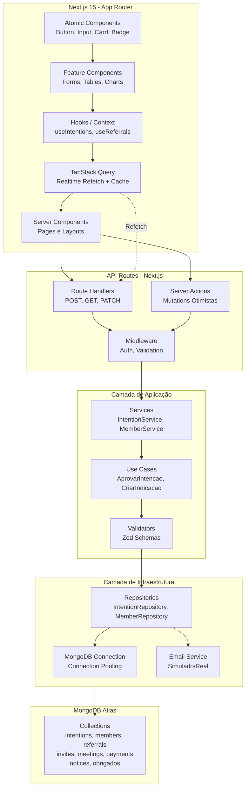
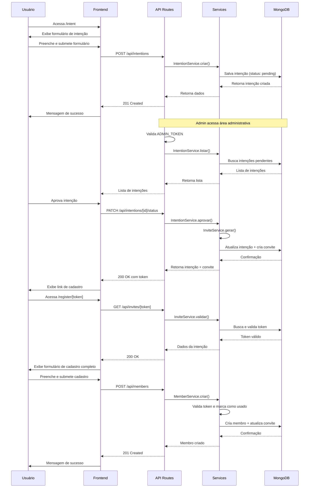
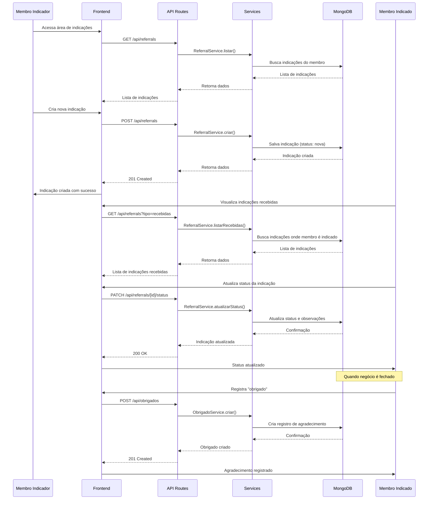
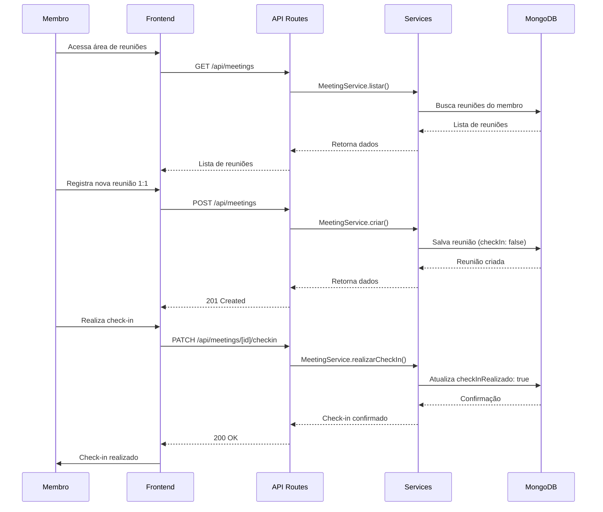

# 📘 Organização Inicial do Projeto
**Projeto:** Plataforma de Gestão para Grupos de Networking  
**Stack:** Next.js 15 (App Router) + Node.js + MongoDB + TailwindCSS + ShadCN/UI + Jest + React Testing Library + Cypress  
**Arquitetura:** Clean Architecture + Clean Code + UI Otimista + ATOMIC Design + Mobile First  

---

## 🎯 1. Objetivo do Sistema
O objetivo é digitalizar e otimizar a gestão de grupos de networking, eliminando planilhas e controles manuais, através de uma solução integrada, responsiva, em tempo real e altamente performática.

---

## 📊 1.1 Status de Implementação

### ✅ Concluído
- [x] **Feature 1: Setup e Infraestrutura Base**
  - Configuração do Next.js 15 com App Router
  - Conexão MongoDB com connection pooling e transactions
  - TanStack Query configurado com refetch inteligente
  - Jest e React Testing Library configurados
  - Estrutura de pastas organizada (Clean Architecture)
  - Variáveis de ambiente configuradas

- [x] **Feature 2: Componentes UI Base (Parcial)**
  - Button (variantes, tamanhos, loading, animações)
  - Input (label, error, helperText)
  - Textarea
  - Card (variantes, subcomponentes)
  - Badge (variantes de status)
  - Skeleton (loading states)

- [x] **Feature 3: Fluxo de Admissão - Intenções Públicas**
  - API Route: `POST /api/intentions`
  - Página pública: `app/intention/page.tsx`
  - Formulário: `IntentionForm.tsx` com validação React Hook Form + Zod
  - Hook: `useIntentions.ts` com React Query
  - Testes unitários e de integração

- [x] **Estrutura de Dados**
  - Tipos TypeScript: Intention, Member, Invite, Referral
  - DTOs para todas as entidades
  - Validações Zod implementadas

- [x] **Repositórios MongoDB**
  - IntentionRepository
  - MemberRepository
  - InviteRepository
  - ReferralRepository

- [x] **Serviços de Aplicação**
  - IntentionService (validação, criação, busca, atualização)
  - InviteService (geração de token, validação, marcação de uso)
  - MemberService (criação com validação de token)
  - ReferralService (criação, busca, atualização de status)

- [x] **Helpers de Teste**
  - Faker.js configurado (pt_BR)
  - Funções para gerar dados fake
  - Seeders para popular banco de dados

### ✅ Concluído (Atualizado)
- [x] **Feature 4: Fluxo de Admissão - Área Administrativa**
  - Listagem de intenções com paginação e filtros
  - Aprovação/recusa de intenções
  - Geração automática de convite ao aprovar
  - Proteção com ADMIN_TOKEN
  - Página admin `/admin/intents`
  - Componentes: IntentionList, IntentionCard

- [x] **Feature 5: Sistema de Convites (APIs)**
  - API POST /api/invites (gerar convite manualmente)
  - API GET /api/invites/[token] (validar token)
  - Geração automática ao aprovar intenção
  - Validação de token (expirado, usado)

- [x] **Feature 6: Cadastro Completo de Membros**
  - Página pública `/register/[token]`
  - Validação de token antes de exibir formulário
  - Formulário completo (telefone, linkedin, área de atuação)
  - API POST /api/members
  - Marca token como usado após cadastro
  - Componente: MemberForm

### 🚧 Em Progresso
- [ ] Feature 7: Sistema de Indicações

### 📋 Pendente
- [ ] Feature 8: Testes e Qualidade (cobertura ≥ 95%)
- [ ] Feature 9: Documentação adicional
- [ ] Feature 10: Refinamentos e Otimizações

---

## 🧩 2. Funcionalidades Principais

### **2.1 Gestão de Membros**
- Formulário público de **intenção de participação** (nome, e-mail, empresa, cargo, motivo).  
- Painel administrativo com **aprovação/recusa** de intenções.  
- Geração de **token único** de convite para cadastro completo.  
- Formulário de **cadastro completo** com dados adicionais (telefone, rede social, empresa).  

### **2.2 Comunicação e Engajamento**
- Área de **avisos e comunicados internos**.  
- Controle de **presença (check-in)** em reuniões.  

### **2.3 Geração de Negócios**
- Criação e acompanhamento de **indicações de negócios** entre membros.  
- Status: *pendente*, *em andamento*, *concluído*, *cancelado*.  
- Registro de **“obrigados”**, agradecimentos públicos por negócios concluídos.  

### **2.4 Acompanhamento e Performance**
- Registro de **reuniões 1:1** entre membros.  
- **Dashboard de performance** individual e coletivo.  
- Relatórios (semanal, mensal e acumulado).  

### **2.5 Financeiro**
- **Módulo de mensalidades** com geração e controle de status de pagamento.  

---

## 🏗️ 3. Arquitetura da Solução



### **3.1 Padrão de Camadas**
- **Domain:** regras de negócio puras.  
- **Application:** casos de uso e validações.  
- **Infrastructure:** persistência, conexão, providers.  
- **Presentation:** API Routes + UI com Server Actions.  

### **3.2 Boas Práticas**
- Clean Code + Clean Architecture.  
- ESLint + Prettier + Husky.  
- UI otimista e refetch automático inteligente.  
- Testes unitários e e2e reais com cobertura mínima de **95%**.  
- Design ATOMIC para responsividade granular.  

---

## 🧱 4. Modelo de Dados (MongoDB)

### **4.1 Justificativa da Escolha do MongoDB**

O MongoDB foi escolhido como banco de dados por oferecer:
- **Flexibilidade de Schema**: Permite evolução natural do modelo de dados sem migrações complexas
- **Escalabilidade Horizontal**: Suporta crescimento através de sharding
- **Integração Nativa com JavaScript/TypeScript**: Documentos JSON nativos facilitam integração com Next.js
- **Performance em Consultas Complexas**: Índices otimizados para queries de relacionamentos e agregações
- **Suporte a Arrays e Objetos Aninhados**: Ideal para estruturas como histórico de status, tags, etc.
- **MongoDB Atlas**: Solução gerenciada que simplifica deploy e manutenção

### **4.2 Collections e Schemas**

#### **Collection: `intentions`**
Armazena intenções de participação submetidas publicamente.

```typescript
{
  _id: ObjectId,
  nome: string (required, min: 2, max: 100),
  email: string (required, unique, index),
  empresa: string (required, min: 2, max: 100),
  cargo?: string (max: 100),
  motivo: string (required, min: 10, max: 500),
  status: 'pending' | 'approved' | 'rejected' (default: 'pending', index),
  createdAt: Date (default: Date.now, index),
  updatedAt: Date (default: Date.now)
}
```

**Índices:**
- `{ email: 1 }` - Único para evitar duplicatas
- `{ status: 1, createdAt: -1 }` - Composto para listagem admin
- `{ createdAt: -1 }` - Para ordenação temporal

#### **Collection: `invites`**
Gerencia tokens de convite para cadastro completo após aprovação.

```typescript
{
  _id: ObjectId,
  token: string (required, unique, index),
  intencaoId: ObjectId (required, ref: 'intentions', index),
  usado: boolean (default: false, index),
  expiraEm: Date (required, index),
  createdAt: Date (default: Date.now)
}
```

**Índices:**
- `{ token: 1 }` - Único para busca rápida de validação
- `{ intencaoId: 1 }` - Para relacionamento com intenção
- `{ usado: 1, expiraEm: 1 }` - Composto para limpeza de tokens expirados

#### **Collection: `members`**
Armazena membros ativos do grupo após cadastro completo.

```typescript
{
  _id: ObjectId,
  nome: string (required, min: 2, max: 100),
  email: string (required, unique, index),
  telefone?: string (max: 20),
  empresa: string (required, min: 2, max: 100),
  cargo?: string (max: 100),
  linkedin?: string (max: 200),
  areaAtuacao?: string (max: 100),
  intencaoId?: ObjectId (ref: 'intentions'),
  ativo: boolean (default: true, index),
  createdAt: Date (default: Date.now, index),
  updatedAt: Date (default: Date.now)
}
```

**Índices:**
- `{ email: 1 }` - Único para login e busca
- `{ ativo: 1, createdAt: -1 }` - Para listagem de membros ativos
- `{ intencaoId: 1 }` - Para rastreamento de origem

#### **Collection: `referrals`**
Sistema de indicações de negócios entre membros.

```typescript
{
  _id: ObjectId,
  membroIndicadorId: ObjectId (required, ref: 'members', index),
  membroIndicadoId: ObjectId (required, ref: 'members', index),
  empresaContato: string (required, min: 2, max: 100),
  descricao: string (required, min: 10, max: 1000),
  status: 'nova' | 'em-contato' | 'fechada' | 'recusada' (default: 'nova', index),
  valorEstimado?: number,
  observacoes?: string (max: 500),
  createdAt: Date (default: Date.now, index),
  updatedAt: Date (default: Date.now)
}
```

**Índices:**
- `{ membroIndicadorId: 1, status: 1 }` - Para listar indicações feitas
- `{ membroIndicadoId: 1, status: 1 }` - Para listar indicações recebidas
- `{ status: 1, createdAt: -1 }` - Para dashboard e relatórios

#### **Collection: `obrigados`**
Registro de agradecimentos públicos por negócios fechados.

```typescript
{
  _id: ObjectId,
  indicacaoId: ObjectId (required, ref: 'referrals', unique),
  membroIndicadorId: ObjectId (required, ref: 'members', index),
  membroIndicadoId: ObjectId (required, ref: 'members', index),
  mensagem: string (required, min: 10, max: 500),
  publico: boolean (default: true),
  createdAt: Date (default: Date.now, index)
}
```

**Índices:**
- `{ indicacaoId: 1 }` - Único para evitar duplicatas
- `{ membroIndicadorId: 1, createdAt: -1 }` - Para histórico de agradecimentos
- `{ publico: 1, createdAt: -1 }` - Para feed público

#### **Collection: `meetings`**
Controle de reuniões 1:1 entre membros.

```typescript
{
  _id: ObjectId,
  membro1Id: ObjectId (required, ref: 'members', index),
  membro2Id: ObjectId (required, ref: 'members', index),
  data: Date (required, index),
  local?: string (max: 200),
  observacoes?: string (max: 1000),
  checkInRealizado: boolean (default: false),
  createdAt: Date (default: Date.now),
  updatedAt: Date (default: Date.now)
}
```

**Índices:**
- `{ membro1Id: 1, data: -1 }` - Para histórico de reuniões
- `{ membro2Id: 1, data: -1 }` - Para histórico de reuniões (bidirecional)
- `{ data: 1 }` - Para consultas por período

#### **Collection: `notices`**
Avisos e comunicados internos para membros.

```typescript
{
  _id: ObjectId,
  titulo: string (required, min: 5, max: 200),
  conteudo: string (required, min: 10, max: 5000),
  autorId: ObjectId (required, ref: 'members'),
  tipo: 'info' | 'warning' | 'success' | 'urgent' (default: 'info'),
  publico: boolean (default: true, index),
  createdAt: Date (default: Date.now, index),
  updatedAt: Date (default: Date.now)
}
```

**Índices:**
- `{ publico: 1, createdAt: -1 }` - Para listagem de avisos
- `{ tipo: 1, createdAt: -1 }` - Para filtros por tipo

#### **Collection: `payments`**
Controle de mensalidades e pagamentos.

```typescript
{
  _id: ObjectId,
  membroId: ObjectId (required, ref: 'members', index),
  valor: number (required, min: 0),
  mesReferencia: string (required, format: 'YYYY-MM', index),
  status: 'pendente' | 'pago' | 'atrasado' | 'cancelado' (default: 'pendente', index),
  dataVencimento: Date (required, index),
  dataPagamento?: Date,
  metodoPagamento?: string (max: 50),
  observacoes?: string (max: 500),
  createdAt: Date (default: Date.now),
  updatedAt: Date (default: Date.now)
}
```

**Índices:**
- `{ membroId: 1, mesReferencia: 1 }` - Único composto para evitar duplicatas
- `{ status: 1, dataVencimento: 1 }` - Para relatórios financeiros
- `{ mesReferencia: 1, status: 1 }` - Para dashboard financeiro

### **4.3 Relacionamentos**

- `invites.intencaoId` → `intentions._id` (1:1)
- `members.intencaoId` → `intentions._id` (1:1, opcional)
- `referrals.membroIndicadorId` → `members._id` (N:1)
- `referrals.membroIndicadoId` → `members._id` (N:1)
- `obrigados.indicacaoId` → `referrals._id` (1:1)
- `obrigados.membroIndicadorId` → `members._id` (N:1)
- `obrigados.membroIndicadoId` → `members._id` (N:1)
- `meetings.membro1Id` → `members._id` (N:1)
- `meetings.membro2Id` → `members._id` (N:1)
- `notices.autorId` → `members._id` (N:1)
- `payments.membroId` → `members._id` (N:1)

### **4.4 Validações com Zod**

Todos os schemas possuem validações correspondentes em Zod para:
- Validação de entrada nas API Routes
- Type-safety no TypeScript
- Mensagens de erro consistentes
- Sanitização de dados

---

## 🧭 5. Estrutura de Componentes (Next.js 15)

### **5.1 Padrão ATOMIC DESIGN**

A estrutura segue o padrão **ATOMIC DESIGN** para garantir reutilização e manutenibilidade:

**Status de Implementação:**
- ✅ Estrutura base criada
- ✅ Componentes atômicos (ui/) implementados
- ✅ Componentes de features (features/intention/) implementados
- ✅ Repositórios e serviços organizados

```
src/
├── app/                         # Next.js App Router
│   ├── (public)/                # Rotas públicas
│   │   ├── intention/           # Formulário de intenção ✅
│   │   │   └── page.tsx
│   │   └── register/            # Cadastro completo com token
│   │       └── [token]/page.tsx
│   │
│   ├── (admin)/                 # Rotas administrativas
│   │   ├── intents/             # Gestão de intenções
│   │   │   └── page.tsx
│   │   ├── referrals/           # Gestão de indicações
│   │   │   └── page.tsx
│   │   ├── dashboard/           # Dashboard de performance
│   │   │   └── page.tsx
│   │   └── members/             # Lista de membros
│   │       └── page.tsx
│   │
│   ├── api/                     # API Routes
│   │   ├── intentions/
│   │   │   ├── route.ts         # POST ✅
│   │   │   └── [id]/
│   │   │       └── status/route.ts  # PATCH
│   │   ├── invites/
│   │   │   ├── route.ts         # POST
│   │   │   └── [token]/route.ts # GET
│   │   ├── members/
│   │   │   └── route.ts         # POST, GET
│   │   └── referrals/
│   │       ├── route.ts         # GET, POST
│   │       └── [id]/
│   │           └── status/route.ts  # PATCH
│   │
│   ├── layout.tsx               # Layout raiz
│   ├── page.tsx                 # Homepage
│   └── providers.tsx            # ✅ React Query Provider (refetch configurado)
│
├── components/                  # Componentes React
│   ├── ui/                      # ATOMS - Componentes básicos ✅
│   │   ├── button.tsx           # ✅ Implementado
│   │   ├── input.tsx            # ✅ Implementado
│   │   ├── textarea.tsx         # ✅ Implementado
│   │   ├── card.tsx             # ✅ Implementado
│   │   ├── badge.tsx            # ✅ Implementado
│   │   ├── skeleton.tsx         # ✅ Implementado
│   │   └── ...                  # Modal, Toast, Select pendentes
│   │
│   ├── features/                # MOLECULES & ORGANISMS - Por feature
│   │   ├── intention/
│   │   │   ├── IntentionForm.tsx    # ✅ Implementado com testes
│   │   │   └── IntentionList.tsx    # ⏳ Pendente
│   │   ├── member/
│   │   │   ├── MemberForm.tsx
│   │   │   └── MemberCard.tsx
│   │   ├── referral/
│   │   │   ├── ReferralForm.tsx
│   │   │   ├── ReferralTable.tsx
│   │   │   └── ReferralStatusBadge.tsx
│   │   └── dashboard/
│   │       ├── StatsCard.tsx
│   │       └── PerformanceChart.tsx
│   │
│   └── layouts/                 # TEMPLATES - Layouts reutilizáveis
│       ├── AdminLayout.tsx
│       ├── PublicLayout.tsx
│       └── DashboardLayout.tsx

├── hooks/                      # Custom Hooks
│   ├── useIntentions.ts        # ✅ Implementado (criação) com testes
│   ├── useReferrals.ts         # ⏳ Pendente
│   ├── useMembers.ts           # ⏳ Pendente
│   └── useDashboard.ts         # ⏳ Pendente
│
├── services/                   # Camada de Aplicação
│   ├── IntentionService.ts     # ✅ Implementado
│   ├── InviteService.ts        # ✅ Implementado
│   ├── MemberService.ts        # ✅ Implementado
│   ├── ReferralService.ts      # ✅ Implementado
│   └── DashboardService.ts     # ⏳ Pendente
│
├── lib/                        # Infraestrutura
│   ├── mongodb.ts              # ✅ Conexão MongoDB (pooling, transactions)
│   ├── repositories/           # ✅ Camada de Infraestrutura
│   │   ├── IntentionRepository.ts  # ✅ Implementado
│   │   ├── InviteRepository.ts     # ✅ Implementado
│   │   ├── MemberRepository.ts    # ✅ Implementado
│   │   └── ReferralRepository.ts   # ✅ Implementado
│   └── utils.ts               # ✅ Utilitários (cn function)
│
├── types/                      # ✅ TypeScript Types
│   ├── intention.ts            # ✅ Implementado (com DTOs)
│   ├── invite.ts               # ✅ Implementado (com DTOs)
│   ├── member.ts               # ✅ Implementado (com DTOs)
│   ├── referral.ts             # ✅ Implementado (com DTOs)
│   └── ...                     # Meeting, Notice, Payment pendentes
│
├── context/                    # React Contexts (se necessário)
│   └── AuthContext.tsx
│
└── tests/                      # Helpers de teste
    ├── helpers/                # ✅ Helpers de teste
    │   ├── faker.ts            # ✅ Faker.js configurado (pt_BR)
    │   └── seeders.ts          # ✅ Seeders para popular banco
    ├── unit/                   # ✅ Testes unitários (parcial)
    │   └── ...                 # IntentionForm, useIntentions, API Route
    ├── integration/            # ⏳ Testes de integração
    └── e2e/                    # ⏳ Testes end-to-end (Cypress)
```

### **5.2 Organização por Features**

Cada funcionalidade possui:
- **Componentes específicos** em `src/components/features/[feature]/`
- **Hook customizado** em `src/hooks/use[Feature].ts`
- **Service** em `src/services/[Feature]Service.ts`
- **Repository** em `src/lib/repositories/[Feature]Repository.ts`
- **Types** em `src/types/[feature].ts`
- **API Routes** em `src/app/api/[feature]/`

### **5.3 Server Components vs Client Components**

**Server Components (padrão):**
- Páginas (`src/app/**/page.tsx`)
- Layouts (`src/app/layout.tsx`, `src/components/layouts/`)
- Componentes de apresentação sem interatividade

**Client Components (`'use client'`):**
- Formulários interativos
- Componentes com estado (`useState`, `useEffect`)
- Componentes que usam hooks customizados
- Componentes com eventos de usuário

### **5.4 Hooks Customizados**

Hooks criados para encapsular lógica de negócio e integração com React Query:

- `useIntentions()` - Gerenciamento de intenções
- `useReferrals()` - Gerenciamento de indicações
- `useMembers()` - Gerenciamento de membros
- `useDashboard()` - Dados do dashboard

Cada hook utiliza TanStack Query para:
- Cache automático
- Refetch em intervalos
- Refetch on focus/mount
- Mutations otimistas

---

## 🌐 6. API (REST)

A API utiliza **Next.js API Routes** com padrão RESTful. Todas as rotas retornam JSON e seguem convenções HTTP.

### **6.1 Funcionalidade 1: Gestão de Intenções**

#### **POST /api/intentions**
Cria uma nova intenção de participação (público).

**Request:**
```json
{
  "nome": "João Silva",
  "email": "joao@empresa.com",
  "empresa": "Empresa XYZ",
  "cargo": "Diretor Comercial",
  "motivo": "Desejo participar do grupo para expandir minha rede de contatos..."
}
```

**Response 201:**
```json
{
  "success": true,
  "data": {
    "_id": "507f1f77bcf86cd799439011",
    "nome": "João Silva",
    "email": "joao@empresa.com",
    "empresa": "Empresa XYZ",
    "cargo": "Diretor Comercial",
    "motivo": "Desejo participar...",
    "status": "pending",
    "createdAt": "2024-01-15T10:30:00.000Z",
    "updatedAt": "2024-01-15T10:30:00.000Z"
  }
}
```

**Response 400:**
```json
{
  "success": false,
  "error": "Email já cadastrado",
  "details": { "field": "email" }
}
```

#### **GET /api/intentions**
Lista todas as intenções (admin apenas).

**Headers:**
```
Authorization: Bearer {ADMIN_TOKEN}
```

**Query Parameters:**
- `status` (opcional): `pending | approved | rejected`
- `page` (opcional): número da página (default: 1)
- `limit` (opcional): itens por página (default: 20)

**Response 200:**
```json
{
  "success": true,
  "data": [
    {
      "_id": "507f1f77bcf86cd799439011",
      "nome": "João Silva",
      "email": "joao@empresa.com",
      "empresa": "Empresa XYZ",
      "status": "pending",
      "createdAt": "2024-01-15T10:30:00.000Z"
    }
  ],
  "pagination": {
    "page": 1,
    "limit": 20,
    "total": 45,
    "totalPages": 3
  }
}
```

#### **PATCH /api/intentions/[id]/status**
Aprova ou recusa uma intenção (admin apenas).

**Headers:**
```
Authorization: Bearer {ADMIN_TOKEN}
```

**Request:**
```json
{
  "status": "approved"
}
```

**Response 200:**
```json
{
  "success": true,
  "data": {
    "_id": "507f1f77bcf86cd799439011",
    "status": "approved",
    "updatedAt": "2024-01-15T11:00:00.000Z"
  },
  "invite": {
    "token": "abc123def456",
    "expiraEm": "2024-01-22T11:00:00.000Z"
  }
}
```

**Response 404:**
```json
{
  "success": false,
  "error": "Intenção não encontrada"
}
```

---

### **6.2 Funcionalidade 2: Sistema de Convites**

#### **POST /api/invites** ✅ **IMPLEMENTADO**
Gera um convite manualmente (admin apenas). Também é gerado automaticamente ao aprovar intenção.

**Headers:**
```
Authorization: Bearer {ADMIN_TOKEN}
```

**Request:**
```json
{
  "intencaoId": "507f1f77bcf86cd799439011"
}
```

**Response 201:**
```json
{
  "success": true,
  "data": {
    "_id": "507f1f77bcf86cd799439012",
    "token": "abc123def456ghi789",
    "intencaoId": "507f1f77bcf86cd799439011",
    "usado": false,
    "expiraEm": "2024-01-22T11:00:00.000Z",
    "criadoEm": "2024-01-15T11:00:00.000Z"
  },
  "url": "https://app.com/register/abc123def456ghi789"
}
```

#### **GET /api/invites/[token]** ✅ **IMPLEMENTADO**
Valida um token de convite (público).

**Response 200:**
```json
{
  "success": true,
  "data": {
    "token": "abc123def456ghi789",
    "valido": true,
    "expiraEm": "2024-01-22T11:00:00.000Z",
    "intencao": {
      "nome": "João Silva",
      "email": "joao@empresa.com",
      "empresa": "Empresa XYZ",
      "cargo": "Diretor Comercial"
    }
  }
}
```

**Response 400:**
```json
{
  "success": false,
  "error": "Token inválido ou expirado"
}
```

#### **POST /api/members** ✅ **IMPLEMENTADO**
Cadastro completo de membro usando token de convite (público).

**Request:**
```json
{
  "token": "abc123def456ghi789",
  "nome": "João Silva",
  "email": "joao@empresa.com",
  "telefone": "+55 11 99999-9999",
  "empresa": "Empresa XYZ",
  "cargo": "Diretor Comercial",
  "linkedin": "https://linkedin.com/in/joaosilva",
  "areaAtuacao": "Vendas e Marketing"
}
```

**Response 201:**
```json
{
  "success": true,
  "data": {
    "_id": "507f1f77bcf86cd799439013",
    "nome": "João Silva",
    "email": "joao@empresa.com",
    "empresa": "Empresa XYZ",
    "criadoEm": "2024-01-15T12:00:00.000Z"
  },
  "message": "Cadastro realizado com sucesso!"
}
```

**Response 400:**
```json
{
  "success": false,
  "error": "Token inválido ou já utilizado"
}
```

---

### **6.3 Funcionalidade 3: Sistema de Indicações**

#### **POST /api/referrals**
Cria uma nova indicação de negócio (membro autenticado).

**Headers:**
```
Authorization: Bearer {MEMBER_TOKEN}
```

**Request:**
```json
{
  "membroIndicadoId": "507f1f77bcf86cd799439013",
  "empresaContato": "Empresa ABC",
  "descricao": "Indicação de cliente potencial para serviços de consultoria...",
  "valorEstimado": 50000
}
```

**Response 201:**
```json
{
  "success": true,
  "data": {
    "_id": "507f1f77bcf86cd799439014",
    "membroIndicadorId": "507f1f77bcf86cd799439010",
    "membroIndicadoId": "507f1f77bcf86cd799439013",
    "empresaContato": "Empresa ABC",
    "descricao": "Indicação de cliente potencial...",
    "status": "nova",
    "valorEstimado": 50000,
    "createdAt": "2024-01-15T14:00:00.000Z"
  }
}
```

#### **GET /api/referrals**
Lista indicações do membro autenticado.

**Headers:**
```
Authorization: Bearer {MEMBER_TOKEN}
```

**Query Parameters:**
- `tipo` (opcional): `feitas | recebidas` (default: ambas)
- `status` (opcional): `nova | em-contato | fechada | recusada`
- `page` (opcional): número da página
- `limit` (opcional): itens por página

**Response 200:**
```json
{
  "success": true,
  "data": {
    "feitas": [
      {
        "_id": "507f1f77bcf86cd799439014",
        "membroIndicado": {
          "nome": "Maria Santos",
          "empresa": "Empresa DEF"
        },
        "empresaContato": "Empresa ABC",
        "status": "nova",
        "createdAt": "2024-01-15T14:00:00.000Z"
      }
    ],
    "recebidas": []
  }
}
```

#### **PATCH /api/referrals/[id]/status**
Atualiza o status de uma indicação (membro autenticado).

**Headers:**
```
Authorization: Bearer {MEMBER_TOKEN}
```

**Request:**
```json
{
  "status": "em-contato",
  "observacoes": "Primeiro contato realizado com sucesso"
}
```

**Response 200:**
```json
{
  "success": true,
  "data": {
    "_id": "507f1f77bcf86cd799439014",
    "status": "em-contato",
    "observacoes": "Primeiro contato realizado com sucesso",
    "updatedAt": "2024-01-16T10:00:00.000Z"
  }
}
```

### **6.4 Padrões de Resposta**

Todas as respostas seguem o formato:
```typescript
{
  success: boolean;
  data?: any;
  error?: string;
  details?: any;
  pagination?: {
    page: number;
    limit: number;
    total: number;
    totalPages: number;
  };
}
```

### **6.5 Status HTTP**

- `200` - Sucesso (GET, PATCH)
- `201` - Criado com sucesso (POST)
- `400` - Erro de validação ou requisição inválida
- `401` - Não autenticado
- `403` - Sem permissão
- `404` - Recurso não encontrado
- `500` - Erro interno do servidor

---

## 🔄 7. Fluxos Principais do Sistema

### **7.1 Fluxo de Admissão de Membros**



**Etapas:**
1. Usuário submete intenção pública
2. Admin visualiza e aprova/recusa
3. Sistema gera token único de convite (válido por 7 dias)
4. Usuário recebe link de cadastro completo
5. Usuário completa cadastro com dados adicionais
6. Membro é criado e token é marcado como usado

### **7.2 Fluxo de Indicação de Negócios**



**Etapas:**
1. Membro A cria indicação para Membro B
2. Membro B visualiza indicação recebida
3. Membro B atualiza status conforme progresso
4. Quando negócio é fechado, Membro B registra "obrigado"
5. Agradecimento público é exibido no feed

### **7.3 Fluxo de Check-in em Reuniões**



---

## 🔒 8. Autenticação e Segurança

### **8.1 Proteção de Rotas Administrativas**

As rotas administrativas são protegidas via **variável de ambiente** `ADMIN_TOKEN`:

```typescript
// Middleware de autenticação admin
const authHeader = request.headers.get('Authorization');
const token = authHeader?.replace('Bearer ', '');

if (token !== process.env.ADMIN_TOKEN) {
  return NextResponse.json(
    { success: false, error: 'Não autorizado' },
    { status: 401 }
  );
}
```

**Rotas Protegidas:**
- `GET /api/intentions` - Listar intenções
- `PATCH /api/intentions/[id]/status` - Aprovar/Recusar
- `POST /api/invites` - Gerar convite
- `GET /api/members` - Listar membros
- `GET /api/dashboard` - Dashboard administrativo

### **8.2 Validação de Tokens de Convite**

Tokens de convite são validados antes de permitir cadastro completo:

```typescript
// Validação de token
const invite = await InviteRepository.buscarPorToken(token);

if (!invite || invite.usado || invite.expiraEm < new Date()) {
  throw new Error('Token inválido ou expirado');
}
```

**Características:**
- Token único gerado com crypto aleatório
- Validade de 7 dias
- Uso único (marcado como `usado: true` após cadastro)
- Índice único no banco para busca rápida

### **8.3 Headers de Segurança**

Headers de segurança devem ser configurados no Next.js:

```typescript
// next.config.ts
const securityHeaders = [
  {
    key: 'X-DNS-Prefetch-Control',
    value: 'on'
  },
  {
    key: 'Strict-Transport-Security',
    value: 'max-age=63072000; includeSubDomains; preload'
  },
  {
    key: 'X-Frame-Options',
    value: 'SAMEORIGIN'
  },
  {
    key: 'X-Content-Type-Options',
    value: 'nosniff'
  },
  {
    key: 'X-XSS-Protection',
    value: '1; mode=block'
  }
];

export default {
  async headers() {
    return [
      {
        source: '/:path*',
        headers: securityHeaders,
      },
    ];
  },
};
```

**Status:** Headers de segurança precisam ser implementados no `next.config.ts`.

### **8.4 Rate Limiting**

Rate limiting básico implementado para prevenir abuso:

- **Formulário de intenção**: Máximo 3 submissões por IP/hora
- **API Routes**: Máximo 100 requisições por IP/minuto
- **Validação de token**: Máximo 10 tentativas por token/hora

### **8.5 Validação de Dados**

Todas as entradas são validadas com **Zod schemas**:

```typescript
// Exemplo: Schema de intenção
const CriarIntencaoSchema = z.object({
  nome: z.string().min(2).max(100),
  email: z.string().email(),
  empresa: z.string().min(2).max(100),
  cargo: z.string().max(100).optional(),
  motivo: z.string().min(10).max(500)
});
```

**Benefícios:**
- Type-safety em tempo de compilação
- Validação em runtime
- Mensagens de erro consistentes
- Sanitização automática

### **8.6 Proteção contra SQL Injection**

MongoDB com driver oficial previne SQL Injection naturalmente através de:
- Queries parametrizadas
- Validação de ObjectIds
- Sanitização de strings

### **8.7 Variáveis de Ambiente**

Todas as configurações sensíveis em `.env.local`:

```env
MONGODB_URI=mongodb+srv://...
MONGODB_DB_NAME=networking_group
ADMIN_TOKEN=seu_token_secreto_aqui
NEXT_PUBLIC_APP_URL=https://app.com
```

**Boas Práticas:**
- Nunca commitar `.env.local` no Git
- Usar `.env.example` como template
- Rotacionar tokens periodicamente
- Usar diferentes tokens para dev/prod

**Status:** Arquivo `.env.example` precisa ser atualizado com todas as variáveis necessárias.

---

## 💡 9. Requisitos Técnicos

### Dependências Principais
- ✅ Next.js 16.0.1 (App Router, Server Actions)
- ✅ TypeScript 5.x
- ✅ MongoDB 7.0.0 (driver oficial)
- ✅ TanStack Query 5.90.7 (realtime refetch)
- ✅ TailwindCSS 4.x + ShadCN/UI
- ✅ Zod 4.1.12 + React Hook Form 7.66.0
- ✅ Jest 30.2.0 + React Testing Library 16.3.0
- ✅ Framer Motion 12.23.24
- ✅ @faker-js/faker 10.1.0 (pt_BR)
- ⏳ Cypress (e2e) - pendente
- ⏳ CI/CD (GitHub Actions) - pendente
- ⏳ Coverage mínima: **95% global** - em progresso  

---

## 📱 10. UI/UX

### Implementado
- ✅ Mobile First + Atomic Responsivity (componentes base)
- ✅ Skeletons implementados (text, circular, rectangular)
- ✅ Optimistic UI (parcial - IntentionForm)
- ✅ Refetch inteligente configurado (onFocus, onMount, staleTime: 5min)
- ✅ Animações com Framer Motion (Button)

### Pendente
- ⏳ Loaders adicionais
- ⏳ Acessibilidade (WCAG 2.1)
- ⏳ Feedbacks via Toasts, modais e banners sutis
- ⏳ Refetch em intervalos (5s)  

---

## 🔍 11. Testes

### Implementado
- ✅ **Testes Unitários:**
  - ✅ Componentes: IntentionForm, Button, Input
  - ✅ Hooks: useIntentions
  - ✅ API Routes: POST /api/intentions
- ✅ **Helpers de Teste:**
  - ✅ Faker.js configurado (pt_BR)
  - ✅ Seeders para popular banco de dados
  - ✅ Funções auxiliares para testes

### Pendente
- ⏳ **Testes Unitários:** Services, Repositories, Utilitários
- ⏳ **Testes de Integração:** Fluxos completos
- ⏳ **E2E (Cypress):** Fluxo completo de admissão e dashboard
- ⏳ **Mock:** MSW (Mock Service Worker)
- ⏳ **Cobertura mínima:** **95% global** (em progresso)  

---

## ⚙️ 12. Deploy
- **Frontend:** Vercel  
- **Backend/API:** rotas integradas (Next.js)  
- **Banco:** MongoDB Atlas  
- **Variáveis (.env.local):**
  ```env
  MONGODB_URI=
  ADMIN_SECRET=
  NEXT_PUBLIC_API_URL=
  ```

---

## 📊 13. Critérios de Avaliação (Ajustados)

| Critério | Peso | Requisito |
|-----------|-------|-----------|
| Componentização e Qualidade | 90% | Componentes atômicos, reutilizáveis e performáticos |
| Testes (Unit + E2E) | 95% | Cobertura mínima global 95% |
| Integração Fullstack | 100% | Comunicação e sincronização em tempo real |
| Boas práticas | 75% | Clean Code, Commits claros, Documentação e UI/UX |

---

## ✅ 14. Conclusão
Este documento define uma base sólida para a implementação de um sistema moderno, escalável e responsivo, aplicando os princípios de **Clean Code**, **Clean Architecture**, **Atomic Design**, **UI Otimista** e **Realtime Refetch**.  

### Progresso Atual
O projeto está em desenvolvimento ativo com a base sólida já implementada:
- ✅ Infraestrutura completa (MongoDB, React Query, Jest)
- ✅ Componentes UI base (Button, Input, Textarea, Card, Badge, Skeleton)
- ✅ Fluxo de intenções públicas funcional
- ✅ Camadas de arquitetura (Repositories, Services, Types)
- ✅ Helpers de teste configurados

### ✅ Correções de Configuração Concluídas
Todas as correções de configuração identificadas na seção 15 foram concluídas:
1. ✅ Corrigidos caminhos no `jest.config.js` para estrutura `src/`
2. ✅ Criado arquivo `.env.example` com todas as variáveis necessárias
3. ✅ Adicionados headers de segurança no `next.config.ts`
4. ✅ Padronizados imports TypeScript (ajustados paths e revisados imports)

### Próximos Passos
- ✅ **CONCLUÍDO:** Correções de configuração (seção 15)
- ✅ **CONCLUÍDO:** Área administrativa para gestão de intenções
- ✅ **CONCLUÍDO:** Sistema completo de convites e cadastro de membros
- 🚧 Sistema de indicações de negócios
- 📋 Testes com cobertura ≥ 95% (em progresso)
- 📋 Refinamentos e otimizações

Com cobertura de testes de **95%+** (meta), o sistema garantirá confiabilidade e alto padrão de qualidade.

---

## ⚠️ 15. Problemas de Configuração Identificados

Antes de iniciar a implementação das features pendentes, os seguintes problemas de configuração precisam ser corrigidos:

### **15.1 Configuração do Jest (jest.config.js)** ✅ **CONCLUÍDO**

**Problema:** Os caminhos de cobertura estavam incorretos - estava procurando em `app/**`, `components/**`, mas o projeto usa `src/app/**`, `src/components/**`.

**Correção realizada:**
- ✅ Ajustado `collectCoverageFrom` para usar `src/app/**`, `src/components/**`, `src/hooks/**`, `src/services/**`, `src/lib/**`
- ✅ Ajustado `moduleNameMapper` para mapear `@/*` para `<rootDir>/src/*`

### **15.2 Arquivo .env.example** ✅ **CONCLUÍDO**

**Problema:** Arquivo não existia, mas é necessário conforme boas práticas.

**Correção realizada:**
- ✅ Criado `.env.example` na raiz do projeto com todas as variáveis de ambiente necessárias:
  ```env
  MONGODB_URI=mongodb+srv://...
  MONGODB_DB_NAME=networking_group
  ADMIN_TOKEN=seu_token_secreto_aqui
  NEXT_PUBLIC_APP_URL=http://localhost:3000
  ```

### **15.3 Headers de Segurança (next.config.ts)** ✅ **CONCLUÍDO**

**Problema:** Headers de segurança não estavam configurados conforme documentação.

**Correção realizada:**
- ✅ Adicionada função `headers()` no `next.config.ts` com os headers de segurança:
  - X-DNS-Prefetch-Control
  - Strict-Transport-Security
  - X-Frame-Options
  - X-Content-Type-Options
  - X-XSS-Protection

### **15.4 Inconsistência nos Imports TypeScript** ✅ **CONCLUÍDO**

**Problema:** Alguns arquivos usavam `@/src/...` e outros `@/lib/...`. O `tsconfig.json` definia `@/*` como `./*`, então havia inconsistência.

**Correção realizada:**
- ✅ Ajustado `tsconfig.json` para que `@/*` aponte para `./src/*`
- ✅ Padronizados todos os imports para usar `@/...` (sem `src/`):
  - `@/src/types/...` → `@/types/...`
  - `@/src/services/...` → `@/services/...`
  - `@/src/hooks/...` → `@/hooks/...`
- ✅ Revisados e corrigidos todos os imports no projeto (15 arquivos atualizados)

### **15.5 Estrutura de Pastas**

**Observação:** O projeto utiliza a estrutura `src/` para organização do código. Todos os caminhos de configuração devem considerar essa estrutura.

**Estrutura atual:**
```
src/
├── app/          # Next.js App Router
├── components/   # Componentes React
├── hooks/        # Custom Hooks
├── services/     # Camada de Aplicação
├── lib/          # Infraestrutura (MongoDB, Repositories, Utils)
├── types/        # TypeScript Types
└── tests/        # Helpers de teste
```

---

## 📋 16. Checklist de Implementação

### **Infraestrutura e Configuração**
- [x] Configuração do projeto Next.js 15 com App Router
- [x] Configuração do MongoDB (conexão, pooling, transactions)
- [x] Configuração do TanStack Query (providers, cache, refetch)
- [x] Configuração do Jest e React Testing Library
- [ ] Configuração do ESLint e Prettier
- [x] Configuração do TailwindCSS e ShadCN/UI
- [x] **Setup de variáveis de ambiente (.env.example)** - ✅ **CONCLUÍDO**
- [x] **Configuração de headers de segurança** - ✅ **CONCLUÍDO**
- [x] **Correção de caminhos no jest.config.js** - ✅ **CONCLUÍDO**
- [x] **Padronização de imports TypeScript** - ✅ **CONCLUÍDO**

### **Componentes UI Base (ATOMIC)**
- [x] Button (variantes, tamanhos, loading, animações)
- [x] Input (label, error, helperText)
- [x] Textarea
- [x] Card (header, content, footer)
- [x] Badge (variantes de status)
- [x] Skeleton (loading states)
- [ ] Modal/Dialog
- [ ] Toast/Notification
- [ ] Table (componentes de tabela)
- [ ] Form (wrapper com validação)

### **Gestão de Membros - Fluxo de Admissão**
- [x] **Página de Intenção Pública**
  - [x] Formulário de intenção (`/intention`)
  - [x] Validação com Zod e React Hook Form
  - [x] Integração com API POST /api/intentions
  - [x] Feedback visual (sucesso/erro)
  - [x] Testes unitários do formulário
  - [x] Testes de integração da API

- [x] **Área Administrativa - Gestão de Intenções**
  - [x] Listagem de intenções (`/admin/intents`)
  - [x] Filtros por status (pending, approved, rejected)
  - [x] Paginação
  - [x] Ações de aprovar/recusar
  - [x] Proteção com ADMIN_TOKEN
  - [x] Componentes: IntentionList, IntentionCard
  - [x] Hook useIntentions atualizado
  - [x] API GET /api/intentions (admin)
  - [x] API PATCH /api/intentions/[id]/status
  - [ ] Testes de integração

- [x] **Sistema de Convites**
  - [x] Geração automática de token ao aprovar
  - [x] Repository de convites
  - [x] Service de convites
  - [x] API POST /api/invites
  - [x] API GET /api/invites/[token]
  - [x] Validação de token (expirado, usado)
  - [ ] Testes unitários e integração

- [x] **Cadastro Completo de Membros**
  - [x] Página de cadastro com token (`/register/[token]`)
  - [x] Validação de token antes de exibir formulário
  - [x] Formulário completo (telefone, linkedin, área de atuação)
  - [x] Componente: MemberForm
  - [x] API POST /api/members
  - [x] Marcar token como usado após cadastro
  - [ ] Testes E2E do fluxo completo

### **Sistema de Indicações (Opção A)**
- [ ] **Criação de Indicações**
  - [ ] Formulário de indicação
  - [ ] Seleção de membro indicado
  - [ ] Campos: empresa, descrição, valor estimado
  - [ ] API POST /api/referrals
  - [ ] Testes unitários

- [ ] **Gestão de Indicações**
  - [ ] Página de indicações (`/admin/referrals` ou `/referrals`)
  - [ ] Listagem de indicações feitas
  - [ ] Listagem de indicações recebidas
  - [ ] Filtros por status
  - [ ] API GET /api/referrals
  - [ ] Testes de integração

- [ ] **Atualização de Status**
  - [ ] Componente de atualização de status
  - [ ] API PATCH /api/referrals/[id]/status
  - [ ] Histórico de mudanças
  - [ ] Testes unitários

- [ ] **Sistema de "Obrigados"**
  - [ ] Formulário de agradecimento
  - [ ] API POST /api/obrigados
  - [ ] Feed público de agradecimentos
  - [ ] Testes de integração

### **Dashboard de Performance (Opção B)**
- [ ] **Dashboard Administrativo**
  - [ ] Página de dashboard (`/admin/dashboard`)
  - [ ] Cards de estatísticas (membros ativos, indicações, obrigados)
  - [ ] Gráficos de performance
  - [ ] Filtros por período (semanal, mensal, acumulado)
  - [ ] API GET /api/dashboard
  - [ ] Testes de integração

- [ ] **Métricas e Relatórios**
  - [ ] Total de membros ativos
  - [ ] Total de indicações no mês
  - [ ] Total de "obrigados" no mês
  - [ ] Taxa de conversão de intenções
  - [ ] Performance individual de membros
  - [ ] Testes unitários dos cálculos

### **Comunicação e Engajamento**
- [ ] **Sistema de Avisos**
  - [ ] CRUD de avisos (admin)
  - [ ] Listagem pública de avisos
  - [ ] Tipos de aviso (info, warning, success, urgent)
  - [ ] API de avisos
  - [ ] Testes de integração

- [ ] **Check-in em Reuniões**
  - [ ] Formulário de registro de reunião 1:1
  - [ ] Listagem de reuniões
  - [ ] Funcionalidade de check-in
  - [ ] API de reuniões
  - [ ] Testes de integração

### **Módulo Financeiro**
- [ ] **Controle de Mensalidades**
  - [ ] Geração de mensalidades (automática ou manual)
  - [ ] Listagem de pagamentos
  - [ ] Atualização de status de pagamento
  - [ ] Relatórios financeiros
  - [ ] API de pagamentos
  - [ ] Testes de integração

### **Hooks Customizados**
- [x] `useIntentions()` - Gerenciamento de intenções (criação implementada)
- [ ] `useReferrals()` - Gerenciamento de indicações
- [ ] `useMembers()` - Gerenciamento de membros
- [ ] `useDashboard()` - Dados do dashboard
- [x] Testes unitários do hook `useIntentions`

### **Services (Camada de Aplicação)**
- [x] `IntentionService` - Lógica de negócio de intenções
- [x] `InviteService` - Lógica de negócio de convites
- [x] `MemberService` - Lógica de negócio de membros
- [x] `ReferralService` - Lógica de negócio de indicações
- [ ] `DashboardService` - Lógica de negócio do dashboard
- [ ] Testes unitários de cada service

### **Repositories (Camada de Infraestrutura)**
- [x] `IntentionRepository` - Acesso a dados de intenções
- [x] `InviteRepository` - Acesso a dados de convites
- [x] `MemberRepository` - Acesso a dados de membros
- [x] `ReferralRepository` - Acesso a dados de indicações
- [ ] `MeetingRepository` - Acesso a dados de reuniões
- [ ] `NoticeRepository` - Acesso a dados de avisos
- [ ] `PaymentRepository` - Acesso a dados de pagamentos
- [ ] Testes unitários de cada repository

### **Validações e Schemas**
- [x] Schemas Zod para todas as entidades principais (Intention, Member, Invite, Referral)
- [x] Validação na API Route POST /api/intentions
- [x] Mensagens de erro consistentes
- [x] Testes de validação (parcial)

### **Testes**
- [ ] **Testes Unitários**
  - [x] Componentes UI (parcial - IntentionForm, Button, Input)
  - [x] Hooks customizados (parcial - useIntentions)
  - [ ] Services (cobertura mínima 95%)
  - [ ] Repositories (cobertura mínima 90%)
  - [ ] Utilitários (cobertura mínima 95%)

- [ ] **Testes de Integração**
  - [x] API Route POST /api/intentions
  - [ ] Fluxo completo de admissão
  - [ ] Fluxo de criação de indicação
  - [ ] Fluxo de aprovação de intenção
  - [ ] API Routes principais

- [ ] **Testes E2E (Cypress)**
  - [ ] Fluxo completo de admissão (intenção → aprovação → cadastro)
  - [ ] Fluxo de indicação de negócios
  - [ ] Dashboard administrativo
  - [ ] Cobertura mínima de 80% dos fluxos críticos

- [ ] **Cobertura Global**
  - [ ] Cobertura mínima de 95% global
  - [ ] Relatório de cobertura gerado
  - [ ] CI/CD com verificação de cobertura

### **UI/UX e Performance**
- [x] Design Mobile First implementado (parcial)
- [x] Componentes responsivos (mobile, tablet, desktop) - componentes base
- [x] Estados de loading (Skeletons implementados)
- [x] UI Otimista em mutations (parcial - IntentionForm)
- [x] Refetch automático (onFocus, onMount configurados no React Query)
- [ ] Feedback visual (Toasts, Modals) - pendente componentes
- [ ] Acessibilidade (WCAG 2.1 básico)
- [x] Animações com Framer Motion (Button implementado)

### **Documentação**
- [ ] README.md completo com instruções de instalação
- [ ] Documentação de API (comentários nos endpoints)
- [ ] Documentação de componentes (JSDoc)
- [ ] Guia de contribuição
- [ ] Documentação de deploy

### **Deploy e CI/CD**
- [ ] Configuração do Vercel
- [ ] Variáveis de ambiente configuradas
- [ ] MongoDB Atlas configurado
- [ ] GitHub Actions para CI/CD
- [ ] Testes automatizados no CI
- [ ] Deploy automático em produção

### **Boas Práticas**
- [ ] Commits claros e descritivos
- [ ] Código limpo e bem organizado
- [ ] Sem código duplicado
- [ ] Reutilização de componentes e funções
- [ ] TypeScript sem `any` desnecessário
- [ ] Tratamento de erros consistente
- [ ] Logs apropriados